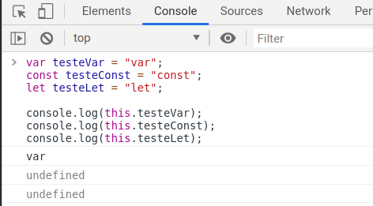
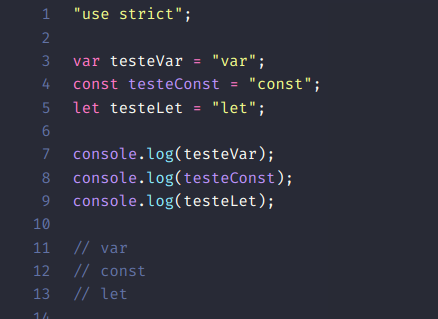
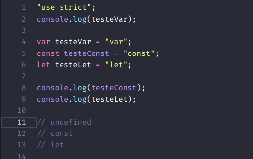
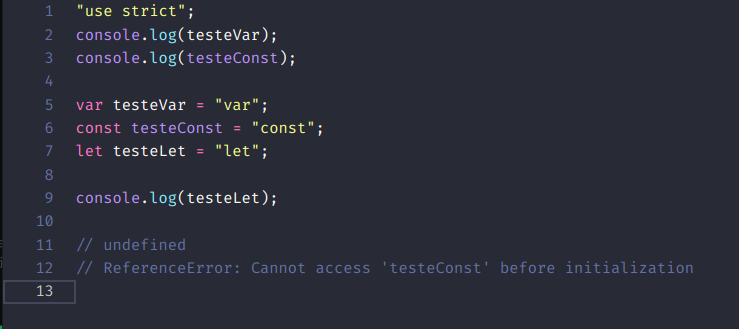

# const, let and var

`const` e `let` são palavras reservadas no javascript incorporadas a partir do ES6.

As variáveis podem ser definidas para diferentes escopos (_scopes_), podem ser o escopo global, o da função e o escopo do bloco.

## `const`

- significa que a uma variável (_label_, indentificador) não pode ser reatribuído um novo valor.
- **NÃO** significa que um `object` atribuído a um identificador com `const` tenha suas propriedades alteradas.
- **NÃO** significa que um `array` atribuído a um identificador com `const` tenha valores alterados.
- o uso do `const` deixa o código mais claro quando não há intenção de que a variável tenha o seu valor reatribuído.

## `let`

[MDN](https://developer.mozilla.org/en-US/docs/Web/JavaScript/Reference/Statements/let)

- significa que a uma variável será atribuído diferentes valores.
- restrito ao escopo do bloco.
- as variàveis declaradas com `let` são _hoisting_ para o topo do bloco de código, mas caso sejam referênciadas antes da sua declaração um erro será lançado: _ReferenceError_. (as variáveis estarão no _temporal dead zone_ até à sua declaração.)
- as variáveis declaradas com `let` (denro do escopo do bloco) não podem ser declaradas novamente (_TypeError_).
- NO BROWSER: com `let` as variáveis declaradas no escopo global ou de funções **NÃO** cria a propriedade no objecto global `window` (_global object_).

## `var`

[MDN](https://developer.mozilla.org/en-US/docs/Web/JavaScript/Reference/Statements/var)

- todas as variáveis definidas com `var`, venham elas a sofrer ou não uma reatribuição, sempre terão dois tipos de escopo: o global, se definidas fora de uma função e o de função quando definidas na definição da função.
- **NÃO** tem escopo de bloco para variáveis definidas com `var`.
- as variáveis declaradas com `var` serão _hoisting_ (alavancadas para o topo) dentro do escopo delas. Isto é, **apenas a declaração** da variável será colocada no topo do código global ou do código da função.

  

  

- o `console.log(testeVar)` retornou `undefined`, porque apenas a declaração da variável é que é _hoisting_

  

