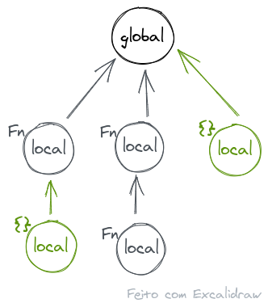
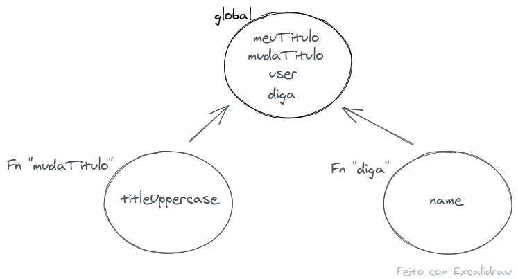
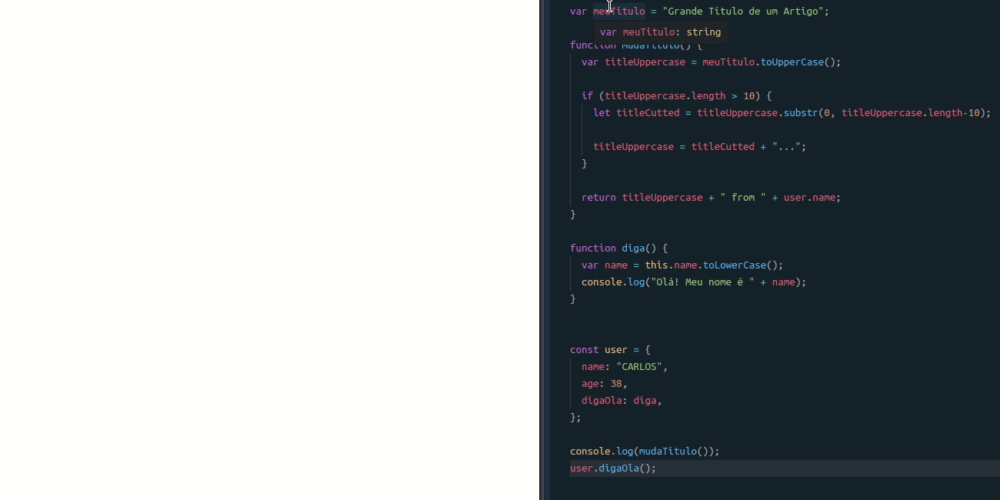

# Fundações do Javascript

<div align="center">
  
</div>

# O "Scope" no javascript

Falar do escopo é procurar **entender a visibilidade, a disponibilidade das variáveis** durante a execução do código. Já que, é durante a execução do código que o uso das variáveis fazem sentido e o momento em que terão seus valores/dados atribuídos.

### Apesar do valor das variáveis serem atribuídas no momento em que o código é executado a visibilidade/disponibilidade das variáveis será determinada antes da execução.

🤔 Então o uso dos valores pelo código ocorre durante a execução do código! Mas a declaração das variáveis é realizada em um momento antes da sua execução.

Variável !== Valor

Declaração !== Atribuíção

### Assim para se estudar o escopo não irá interessar as atribuições mas sim a declaração das variáveis.

### Em suma: o escopo está associado às variáveis, e, mais especificamente, à sua declaração, determinando (amarrando) a visibilidade dessa mesma variável antes da execução do código.

---

### \*\*\*Atenção durante todo o percurso estarei me referindo à palavra variável de modo geral, assim `var name;` é a declaração de uma variável com o nome "name" assim como `function funcao() {}` é a declaração de uma função de nome "função"! Em ambos os casos irei referir ambas as declarações como "variáveis".

---

O escopo é determinado como uma das primeiras tarefas do **interpretador** do javascript, e será construído/estruturado pelo interpretador por meio de uma leitura do código antes da sua execução. Depois que o escopo é estruturado ele não irá mudar mais. É portanto um **escopo Estático**.

Como modelo mental, pode-se dizer que o interpretador irá, em um primeiro momento, ler o código e criar o escopo das variáveis. O escopo das variáveis no javascript divide-se em:

- global
- local:
  - de funções; e
  - de bloco (pode ou não criar);

Além do escopo ser global ou local ele também é encadeado como uma árvore, fazendo com que a visibilidade das variáveis ocorra de baixo para cima. Isto fará mais sentido mais à frente.

Metaforicamente...

<div align="center">
  
</div>

Agora colocando variáveis dentro do seu respectivo escopo, por exemplo:

```js
var meuTitulo = "Grande Título de um Artigo";

function mudaTitulo() {
  var titleUppercase = meuTitulo.toUpperCase();
  return titleUppercase;
}

function diga() {
  var name = this.name.toLowerCase();
  console.log("Olá! Meu nome é " + name);
}

var user = {
  name: "CARLOS",
  age: 38,
  digaOla: diga,
};

console.log(mudaTitulo());
user.digaOla();
```

<div align="center">
  
</div>

O que vemos pela árvore é que a função `mudaTitulo` tem visibilidade da variável local `titleUppercase` e das variáveis do escopo acima (_outer scope_), isto é, das variáveis `meuTitulo`, `mudaTitulo`, `user` e `diga`. No entanto, a função `mudaTitulo` não tem visibilidade da variável `name` (local à função `diga`).

Vale à pena lembrar que aqui apenas estamos na fase pré-execução e, portanto, não existem valores, apenas, variáveis.

Mudando um pouco a função `mudaTitulo` para que ela use a variável `user`, tipo assim:

```js
function mudaTitulo() {
  var titleUppercase = meuTitulo.toUpperCase();
  return titleUppercase + " from " + user.name;
}
```

Hum... Mas mesmo a variável `user` sendo declarada depois da função `mudaTitulo` esta ainda teria a visibilidade do `user`? É possível usar o `user` dentro da função `mudaTitulo`?

Sim. Quando a função `mudaTitulo` for executada o escopo já terá sido montado e, portanto, a variável `user` já estará declarada e visível à função `mudaTitulo`.

(conceitualmente isto se dá o nome de _hoisting_ - içamento das variáveis)

### Atenção que estou me referindo à visibilidade da variável e não ao valor. Pois se o valor do `user` vai ser um objecto ou não isso depende de como e em que ordem a atribuíção do objecto `user` ocorre e a função `mudaTitulo` é executada.

Vejamos duas formas de escrever o mesmo código de cima:

1º hipótese

```js
var meuTitulo = "Grande Título de um Artigo";

function mudaTitulo() {
  var titleUppercase = meuTitulo.toUpperCase();
  return titleUppercase + " from " + user.name;
}

function diga() {
  var name = this.name.toLowerCase();
  console.log("Olá! Meu nome é " + name);
}

var user = {
  name: "CARLOS",
  age: 38,
  digaOla: diga,
};

console.log(mudaTitulo());
user.digaOla();
```

A função `mudaTitulo` é declarada antes da variável `user` e como já vimos isso não produz nenhum erro, pois as variáveis serão içadas (sofrem o _hoisting_). Pelo menos não um erro de sintaxe....

Ao executar o código acima teremos como resultado:

```sh
GRANDE TÍTULO DE UM ARTIGO from CARLOS
Olá! Meu nome é carlos
```

Ok, mas e se agora alterarmos o MOMENTO / A ORDEM entre a atribuição da variável `user` e a execução da função?

2º hipótese

```js
var meuTitulo = "Grande Título de um Artigo";

function mudaTitulo() {
  var titleUppercase = meuTitulo.toUpperCase();

  console.log(user);

  return titleUppercase + " from " + user.name;
}

function diga() {
  var name = this.name.toLowerCase();
  console.log("Olá! Meu nome é " + name);
}

console.log(mudaTitulo()); // Alteração da ordem entre a execução da função e da atribuição do valor ao user

var user = {
  name: "CARLOS",
  age: 38,
  digaOla: diga,
};

user.digaOla();
```

Ao executar o código acima teremos como resultado:

```sh
undefined
error: Uncaught TypeError: Cannot read property 'name' of undefined
```

- Embora a variável `user` exista o seu valor ainda está como `undefined` (porque é com este valor que todas as variáveis "nascem") e a atribuíção do valor ainda não terá ocorrido quando a função foi executada.

- A variável `user` existe (é visível) na execução da função `mudaTitulo`, porque a variável sofreu o _hoisting_. E isto ocorre porque o interpretador leu o código antes de executá-lo e construiu o escopo, que é estático e anterior à execução do código.

- Mais uma vez, digo, para o escopo só interessa a declaração e não a atribuição. Como todas as variáveis em javascript "nascem" como `undefined`. Ao usar uma variável que foi içada, esta terá o valor de `undefined`.

### Atenção: ainda não falamos da declaração de variáveis com `let` e `const`.

Mas caso a variável `user` tivesse sido declarada com `const`, no lugar de `var`, apesar do resultado apresentado ser diferente o comportamento do escopo seria o mesmo. A variável `user` estaria visível à função tal e qual foi explicado para o caso do uso do `var`.

A diferença é que com o uso do `const` e do `let` as variáveis, embora existam, ficam indisponíveis e o javascript joga um erro de referência.

["Const, let e var"]('/cap_1_sec_2.md')

> as variàveis declaradas com let são hoisting para o topo do bloco de código, mas caso sejam referênciadas antes da sua declaração um erro será lançado: ReferenceError. (as variáveis estarão no temporal dead zone até à sua declaração.)

## O Escopo Global e Local

Só existe um determinado numero de escopos em javascript, temos o escopo global que é aquele que referência as variáveis declaradas no corpo principal do código e temos o escopo local. O escopo local é aquele construído pelo corpo de funções e pelo corpo de blocos de código que possuam alguma declaração com `let` ou `const`.

Para cada um deles o que irá determinar se pertencem a um ou a outro escopo é a forma como são declaradas as variáveis, assim:

- variáveis declaradas com `var` serão sempre do escopo global ou do escopo local de funções;
- variáveis declaradas com `let` ou `const` serão sempre do escopo global ou do escopo local do bloco (mesmo que o bloco seja o de uma função);
- variáveis declaradas SEM `var`, `let` ou `const` serão sempre do escopo global. (não funciona em modo "strict").

## Exemplos:

<div align="center">
  
</div>
