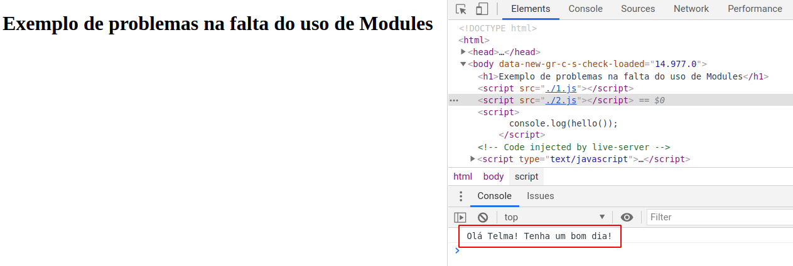
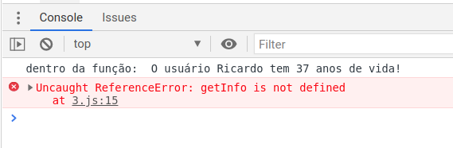
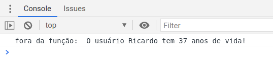
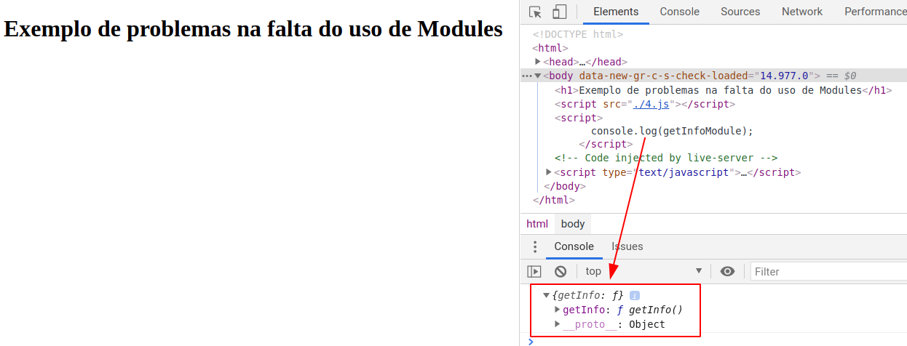
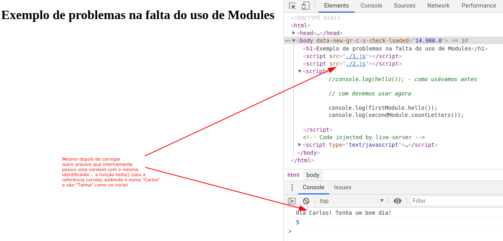
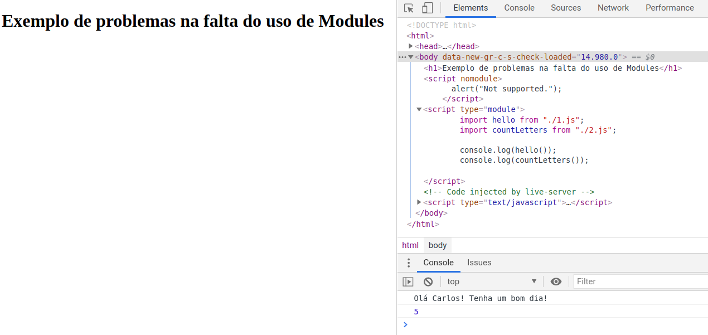

# Fundações do Javascript

<div align="center">
  
</div>

# O "Module Pattern" no javascript

💣 A exposição sobre o padrão de módulos em javascript será feito apenas para o browser e não irei mencionar escopo de bloco até que seja, realmente, relevante.

## O que que este padrão vem resolver? Para isso vamos ver um exemplo que expõe o problema.

1 - incialmente teriamos algo como:

```html
<!DOCTYPE html>
<html>
  <head>
    <meta charset="UTF-8" />
    <title>Document</title>
  </head>
  <body>
    <h1>Exemplo de problemas na falta do uso de Modules</h1>
    <script src="./1.js"></script>
    <script>
      console.log(hello());
    </script>
  </body>
</html>
```

```js
// ./1.js
var name = "Carlos";
function hello() {
  return `Olá ${name}! Tenha um bom dia!`;
}
```

<div align="center">
  
</div>

2 - mas e se um outro código em um outro arquivo for adicionado à página:

```html
<!DOCTYPE html>
<html>
  <head>
    <meta charset="UTF-8" />
    <title>Document</title>
  </head>
  <body>
    <h1>Exemplo de problemas na falta do uso de Modules</h1>

    <script src="./1.js"></script>
    <script src="./2.js"></script>

    <script>
      console.log(hello());
    </script>
  </body>
</html>
```

```js
// ./1js
var name = "Carlos";
function hello() {
  return `Olá ${name}! Tenha um bom dia!`;
}
```

```js
// ./2js
var name = "Telma";
function countLetters() {
  return name.length; //not the best solution, ok!
}
```

<div align="center">
  
</div>

---

- O resultado ao executar a função `hello()` deveria ser **"Olá Carlos! Tenha um bom dia!"**. Mas no lugar de "Carlos" saíu "Telma" que é o valor da variável `name` do segundo arquivo e não do primeiro onde existe a função `hello`.
- Isso aconteceu porque os arquivos 1.js e 2.js estão, ambos, sendo carregados no index.html e, portanto, suas variáveis irão pertencer ao escopo global.... e o segundo carregamento irá sobrepor-se ao primeiro!
- Quanto mais complexa fica a aplicação web mais difícil será controlar as variáveis e as interferências que o código de diferentes arquivos possa criar.
- **cada variável declarada dentro do arquivo irá pertencer ao escopo global** após o carregamento do arquivo.
- lembremos que o escopo em javascript é global ou de função. Portanto qualquer variável declarada dentro do arquivo, mas fora do corpo das funções, ficará visível globalmente (após o carregamento do arquivo).

---

## Antes da existência dos Modules CommonJS, AMD ou do Nativo uma solução era a criação de IIFE para manter as variáveis locais privadas e expor apenas o necessário.

- [IIFE - Immediately Invoked Function Expression](https://developer.mozilla.org/pt-BR/docs/Glossario/IIFE)

\* privadas: porque as variáveis declaradas com `var` dentro das funções ficam restritas ao escopo da função. (irei desconsiderar a declaração de variáveis sem a palavra reservada `var`)

\* 😎 está técnica apesar de ainda ser usada para a implementação deste tipo de padrão, ela não deve ser usada em substituição da modularização Nativa que veio com o ES6.

- Antes de voltarmos ao nosso exemplo original, vejamos um exemplo de IIEF:

```js
// ./3.js
(function () {
  var name = "Ricardo";
  var age = 37;

  function getInfo() {
    return `O usuário ${name} tem ${age} anos de vida!`;
  }

  // aqui tenho acesso/visibilidade às variáveis name, age e à função getInfo

  console.log("dentro da função: ", getInfo());
})();

// SEM acesso/visibilidade às variáveis name, age e à função getInfo
console.log("fora da função: ", getInfo());
```

<div align="center">
  
</div>

- vamos expor a função `getInfo` para que esta possa ser usada pela aplicação como um todo:

```js
// ./3.js
var getInfo = (function () {
  var name = "Ricardo";
  var age = 37;

  function getInfo() {
    return `O usuário ${name} tem ${age} anos de vida!`;
  }

  // aqui tenho acesso/visibilidade às variáveis name, age e à função getInfo

  return getInfo;
})();

// SEM acesso/visibilidade às variáveis name, age
// mas a variável getInfo (fora da IIFE) recebe a função getInfo (retornada da IIFE)
console.log("fora da função: ", getInfo());
```

<div align="center">
  
</div>

## Voltando, parcialmente, ao nosso exemplo:

```html
<!DOCTYPE html>
<html>
  <head>
    <meta charset="UTF-8" />
    <title>Document</title>
  </head>
  <body>
    <h1>Exemplo de problemas na falta do uso de Modules</h1>

    <script src="./4.js"></script>

    <script>
      console.log(getInfoModule);
    </script>
  </body>
</html>
```

```js
// ./4js
// mudei aqui! o nome da variável que ficará visível globalmente tem o nome de
// getInfoModule agora...
var getInfoModule = (function () {
  var name = "Ricardo";
  var age = 37;

  function getInfo() {
    return `O usuário ${name} tem ${age} anos de vida!`;
  }

  return { getInfo }; // mudei aqui! agora retorno um objecto
})();
```

<div align="center">
  
</div>

### Até aqui conseguimos resolver parte do problema, pois, embora não seja possível repetir o nome da variável `getInfoModule` entre diferentes arquivos, podemos ficar descansados quanto ao uso de variáveis ou de funções com o mesmo nome entre diferentes arquivos, desde que estejam dentro da IIFE.

- isto é, deste que estejam restritas dentro do _module_!

## Voltando, 100%, ao nosso exemplo:

```html
<!DOCTYPE html>
<html>
  <head>
    <meta charset="UTF-8" />
    <title>Document</title>
  </head>
  <body>
    <h1>Exemplo de problemas na falta do uso de Modules</h1>

    <script src="./1.js"></script>
    <script src="./2.js"></script>

    <script>
      //console.log(hello()); - como usávamos antes

      // com devemos usar agora
      console.log(firstModule.hello());
      console.log(secondModule.countLetters());
    </script>
  </body>
</html>
```

```js
// ./1js
var firstModule = (function () {
  var name = "Carlos";
  function hello() {
    return `Olá ${name}! Tenha um bom dia!`;
  }

  return { hello };
})();
```

```js
// ./2js
var secondModule = (function () {
  var name = "Telma";

  function countLetters() {
    return name.length; //not the best solution, ok!
  }

  return { countLetters };
})();
```

<div align="center">
  
</div>

---

- Mesmo carregando um arquivo após o outro e mesmo que o segundo arquivo use uma variável com o mesmo identificador da variável do primeiro arquivo. A função `hello()` irá utilizar a referência correta e exibir o nome "Carlos" e não o "Telma" como aconteceu no início!
- A verdade é que as IIFE mantém as variáveis e as funções que não são retornadas com uma visibilidade restrita ao escopo da prórpia função (_closure_).
- Mas repare que ainda não terminamos, pois, se ficássemos por aqui teríamos de cuidar para não repetir o nome da variável que recebe o retorno da IIFE...

---

## Criando um Module Pattern um pouquinho melhor (usando as IIFE)

... só um pouquinho de nada melhor, ok!

```html
<!DOCTYPE html>
<html>
  <head>
    <meta charset="UTF-8" />
    <title>Document</title>
  </head>
  <body>
    <h1>Exemplo de problemas na falta do uso de Modules</h1>

    <script>
      window.modules = {
        temp: {},

        get example() {
          return this.temp;
        },
        set example(value) {
          Object.assign(this.temp, value);
        },
      };
    </script>

    <script src="./1.js"></script>
    <script src="./2.js"></script>

    <script>
      var { hello, countLetters } = modules.example;

      console.log(hello());
      console.log(countLetters());
    </script>
  </body>
</html>
```

```js
// ./1js
modules.example = (function () {
  var name = "Carlos";
  function hello() {
    return `Olá ${name}! Tenha um bom dia!`;
  }

  return { hello };
})();
```

```js
// ./2js
modules.example = (function () {
  var name = "Telma";

  function countLetters() {
    return name.length; //not the best solution, ok!
  }

  return { countLetters };
})();
```

---

- Agora só devemos nos preocupar com aquilo que expomos, no `return` da IIFE!
- 💥 **Este trecho de código NÃO tem grande utilidade. O mais importante é a ideia de modularizar a aplicação, expondo determinadas funções ou até mesmo determinadas variáveis, mas resguardando a privacidade de tantas outras que não devem ser expostas globalmente, pois, apenas servem à sua finalidade dentro do arquivo/"espaço" em que são declaradas.**
- para o browser devemos lembrar que mesmo num mesmo arquivo (bundle) a preocupação em usar módulos é importante!

---

# CommonJS, AMD, UMD e ESM

- Acredito que reconhecer os diferentes sistemas que lidam com o padrão module do javascript seja muito importante, mas sempre que possível utile o padrão nativo que está na _spec_ a partir do ES6 [ECMAScript sec 15.2](http://www.ecma-international.org/ecma-262/11.0/index.html#sec-modules);
- Apesar nos módulos terem sido adotados na especificação da linguagem, eles já existem a muito tempo por meio de bibliotecas;
- O que cada estilo de implementação tem em comum é que:

  - cada _module_ é um trecho de código que é **executado** tão logo seja carregado!
  - possuem uma série de declarações de variáveis ou de funções, mas só será visível o que for "marcado" para ser exportado;
  - podem "importar"/referenciar outros _modules_;
  - **_modules_ são "instanciados" apenas uma vez, mesmo que sejam "importados" em diferentes arquivos. São portanto _SINGLETONS_**

- ## CommonJS

  a) **Só funciona no node**, para usar no browser precisar ser trasnpilado ("compilado", wtf?) e concatenado;

  b) Importa os módulos de forma síncrona (daí o impeditivo de usar no browser!);

  c) Quando importa cria do novo objecto a ser exportado;

  d) _ou Node.js module_;

  e) Por padrão cada arquivo é um module!

para importar, usamos o `require`, por exemplo:

```js
const helloFN = require("./1");

console.log(helloFN());
```

e para exportar...

```js
// ./1.js
var name = "Carlos";

function hello() {
  return `Olá ${name}!`;
}

module.exports = hello;
```

- ## AMD - Asynchronous Module Definition

  a) Importa os módulos de forma assíncrona (daí usar no browser!)

para definir um módulo por exemplo:

```js
define("myModule", ["dep1", "dep2"], (dep1, dep2) => {
  var name = "Carlos";

  function hello() {
    return `Olá ${name}!`;
  }

  return { hello };
});
```

e para usar...

```js
require(["myModule"], (myModule) => {
  myModule.hello();
});
```

- ## UMD - Universal Module Definition

  a) basicamente identifica o ambiente e escolhe entre um ou outro sistema, entre o commonJs e o AMD.

- ## ESM - ES6 Module (ECMAScript 2015)

  a) é o sistema nativo para o Module Pattern;

  b) usa as plavras reservadas `import` e `export`;

  c) repare no uso do `type="module"` dentro da tag `<script>`

  d) no Node.js a extensão do arquivo tem de mudar de '.js' para '.mjs'

  e) Refs: [MDN import](https://developer.mozilla.org/en-US/docs/Web/JavaScript/Reference/Statements/import), [MDN export](https://developer.mozilla.org/en-US/docs/Web/JavaScript/Reference/Statements/export) e [Módulos no Javascript pelo MDN](https://developer.mozilla.org/pt-BR/docs/Web/JavaScript/Guide/M%C3%B3dulos);

  f) o seu estudo é importante, pois a inclusão deste sistema nativo de modules agregou uma série de nuances ao funcionamento de como o código é executado... Como inicialização temos que:

  - o código é tratado (automaticamente) em _strict mode_ (como se fosse adicionado por padrão o "use strict") - isto por si só já causa uma diferença muito grande, apesar de alguns "compiladores", como o Babel, já incluirem o "use strict" por _default_;
  - o valor do `this` é `undefined` (no CommonJS seria o objecto _module.exports_);
  - pode ser analizado estaticamente (para prevenção de erros, otimização de código...);
  - suporta dependência cíclica melhor que o padrão CommonJS

```html
<!DOCTYPE html>
<html>
  <head>
    <meta charset="UTF-8" />
    <title>Document</title>
  </head>
  <body>
    <h1>Exemplo de problemas na falta do uso de Modules</h1>

    <script nomodule>
      alert("Not supported.");
    </script>

    <script type="module">
      import hello from "./1.js";
      import countLetters from "./2.js";

      console.log(hello());
      console.log(countLetters());
    </script>
  </body>
</html>
```

```js
// ./1js
var name = "Carlos";
function hello() {
  return `Olá ${name}! Tenha um bom dia!`;
}

export default hello;
```

```js
// ./2js
var name = "Telma";

function countLetters() {
  return name.length; //not the best solution, ok!
}

export default countLetters;
```

<div align="center">
  
</div>

---

Além das referência já mensionadas as seguintes podem ajudar a aprofundar o assunto:

[ES modules: A cartoon deep-dive](https://hacks.mozilla.org/2018/03/es-modules-a-cartoon-deep-dive/)

[ES6 In Depth: Modules](https://hacks.mozilla.org/2015/08/es6-in-depth-modules/)

[ES6 Modules in Depth](https://ponyfoo.com/articles/es6-modules-in-depth)
