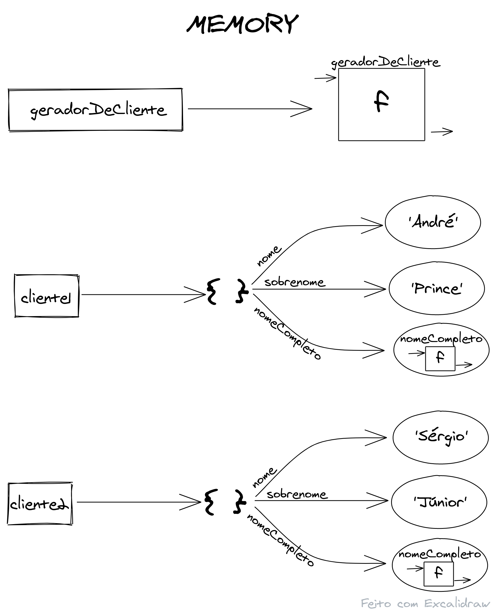
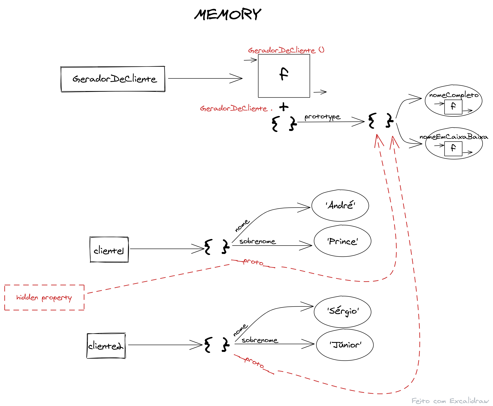

# Classes no Javascript

- Javascript não possuiu classes, não é orientado a classes, no entanto, possuiu mecanismos que permitem o uso de algo muito parecido com classes.
- A vantagem do uso de classes, na minha opinião, é que o seu uso facilita muito a implementação orientada a objectos, além do fato de, no meu caso, estar mais habituado a usar uma programação com o uso de classes.
- Javascript, apesar de oferecer este mecanismo que nos permite usar uma sintaxe muito próxima da que usamos em linguagens orientadas a classes, não possui artifícios exaustivos que permitam o uso completo desse paradigma. Por exemplo, em Javascript não existem interfaces.
- Javascript é orientado a protótipos e entender a cadeia de protótipo (_prototype chain_) vai permitir entender exatamente como funciona essa aproximação às classes.

## Simular um problema

- Em nosso programa (fictício) iremos lidar com dados que se agrupam em uma categoria que no caso será o Cliente. Para isso iremos usar uma estrutura de dados como a seguinte:

```js
// os Dados:
let nome = "Nome";
let sobreNome = "e Sobrenome do Cliente";
function nomeCompleto() {
  return nome + " " + sobreNome;
}

//mas esses dados precisam ser agrupados, daí iremos usar o object
let cliente = Object.create(null);
cliente.nome = "Nome";
cliente.sobreNome = "e Sobrenome do Cliente";
cliente.nomeCompleto = function () {
  return nome + " " + sobreNome;
};

//Os dados estruturados em um object
const cliente = {
  nome: "Nome",
  sobreNome: "e Sobrenome do Cliente",

  nomeCompleto: function () {
    return client.nome + " " + client.sobreNome;
  },
};
```

- Cliente é um objecto que possui duas propriedades, `nome` e `sobrenome`, e um comportamento (método), `nomeCompleto` (por enquanto).
- Agora os dados de um Cliente ficam **encapsulados** em um _object_ com o nome `cliente`.

## Caso tenhamos mais de um cliente, ficará mais fácil lidar com os dados de cada um:

```js
const cliente1 = {
  nome: "André",
  sobreNome: "Prince",

  nomeCompleto: function () {
    return cliente1.nome + " " + cliente1.sobreNome;
  },
};

const cliente2 = {
  nome: "Sérgio",
  sobreNome: "Júnior",

  nomeCompleto: function () {
    return cliente2.nome + " " + cliente2.sobreNome;
  },
};
```

Neste momento na memória temos algo como isto:

<div>
  
</div>

- Mas e se forem 100 clientes....

da forma como está sendo feito pode levar a erros, imagine uma estrutura com 10 propriedades e 10 métodos associados em um object. Além de estarmos repetindo a função (método) `nomeCompleto` para cada um dos objectos criados.

Seria melhor criar um modelo que pudesse fornecer esses objectos com as características e os comportamentos de um Cliente.

## 1º Passo da Solução

Podemos gerar os clientes com uma função geradora (assim, pelo menos, simplificamos a atribuição dos comportamentos - sendo bem simplista)

```js
function geradorDeCliente(nome, sobrenome) {
  const cliente = {}; //o mesmo que Object.create({})
  cliente.nome = nome;
  cliente.sobrenome = sobrenome;

  cliente.nomeCompleto = function () {
    return cliente.nome + " " + cliente.sobrenome;
  };

  return cliente;
}

const cliente1 = geradorDeCliente("André", "Prince");
const cliente2 = geradorDeCliente("Sérgio", "Júnior");
```

Na memória nada mudou a não ser o aparecimento da função geradora.

<div align="center">
  
</div>

- pelo menos agora temos uma fábrica que produz clientes, basta passarmos o nome e o sobrenome desejado!

### ainda estamos sofrendo com o fato de estarmos copiando para cada cliente o método `nomeCompleto`!

- Para melhorar isso partimos para o 2º passo.

## 2º Passo da Solução

- Como já foi dito Javascript não tem uma solução como a de outras linguagens de programação de forma a evitar a repetição acima demonstrada. Em Javascript usamos a cadeia de protótipos (_prototype chain_) para agrupar, em um outro objecto, o código que vem se repetindo a cada ojecto produzido pela função geradora. Cada objecto produzido vai poder acessar aquele objecto (o que agrupa o código repetido) e, consequentemente, as propriedades que se repetem em cada objecto cliente.

- Vamos adicionar outro comportamento ao objecto cliente para melhor demonstração.

```js
const funcoesDeClienteAgrupadas = {
  nomeCompleto: function () {
    return this.nome + " " + this.sobrenome;
  },
  nomeEmCaixaBaixa: function () {
    return this.nome.toLowerCase();
  },
};

function geradorDeCliente(nome, sobrenome) {
  const cliente = Object.create(funcoesDeClienteAgrupadas);
  cliente.nome = nome;
  cliente.sobrenome = sobrenome;

  return cliente;
}

const cliente1 = geradorDeCliente("André", "Prince");
const cliente2 = geradorDeCliente("Sérgio", "Júnior");

console.log(cliente1);
console.log(cliente1.nomeEmCaixaBaixa());
```

- o resultado no console é:

<div align="center">
  
</div>

- o `cliente1` pode acesar o método `nomeEmCaixaBaixa` mesmo que este não esteja contido no objecto cliente1! Isso foi possível porque ao tentar acessar esse método e ele não existindo no objecto `cliente1` o "javascript" irá verificar se esse método existe na cadeia de protótipos desse mesmo objeto.

- detalhes do `Object.create()` em [MDN web docs](https://developer.mozilla.org/pt-BR/docs/Web/JavaScript/Reference/Global_Objects/Object/create)

### na execução do código acima temos algo como:

<div align="center">
  
</div>

- Resumindo:
  Passo 1: criamos uma _factory_ para facilitar a criação de objectos (esta _factory_ permite muitas outras coisas, mas estou focado em chegar no modelo de Classes no javascript)
  Passo 2: usamos a cadeia de protótipos para evitar repetir código entre objectos.

## 2º ½ Passo da Solução

- utilização da palavra reserva `new`. Ao usarmos o `new` antes de uma função geradora (de uma _factory_) o "javascript" automatiza duas coisas para o nosso código:

1 - a criação do novo objecto; e
2 - o retorno desse objecto.

### vejamos:

- no momento temos
<div align="center">
  
</div>

- com a palavra reservada `new`
<div align="center">
  
</div>

- Ok! com o `new` o novo objecto foi criado e retornado automaticamente, mas e as `funçõesDeClienteAgrupadas`?
- e o `this`?: com o uso do `new` na invocação da função geradora **o `this` passa a ser o novo objecto criado**. Caso a função geradora, escrita da forma como está, fosse executada sem a precedência do `new` o `this` seria o que? _depende_, pois pode vir a ser o _Global Object_, o _Window Object_ etc. Quando uma função geradora é implementada como no caso acima ela tem de ser executada com a precedência da palavra reservada `this`.

> :eyes: Por convenção usa-se a primeira letra das funções geradoras, que necessitem ser executadas com a precedência da palavra reservada `new`, escrita em letra maiúscula. Assim a função `geradorDeCliente` passou a ser nomeada como `GeradorDeCliente`.

### 2º ¾ Passo na Solução

- as `funçõesDeClienteAgrupadas` terão de ficar em outro lugar. Mas temos de lembrar que as funções em javascript são na verdade funções e objectos. Por exemplo:

```js
function nomeCompleto(nome, sobrenome) {
  return nome + " " + sobrenome;
}

nomeCompleto.what = "retorna o nome completo";

console.log(nomeCompleto("André", "Prince")); // 'André Prince'
console.log(nomeCompleto.what); // 'retorna o nome completo'
```

- `what` é uma propriedade de `nomeCompleto` e como tal pode ser acessada como acessamos propriedades em objectos (com a notação de `.`)

- Mas objectos (do combo `function`/`object`) possuem uma outra propriedade quando são criados, a propriedade `prototype`.

- detalhes da propriedade `prototype` em [MDN web docs](https://developer.mozilla.org/en-US/docs/Learn/JavaScript/Objects/Object_prototypes)

- Vamos usar esta propriedade `prototype` da parte `object` da função geradora `geradorDeCliente` para guardar os métodos agrupados dos clientes.

### no código passamos a ter:

```js
function GeradorDeCliente(nome, sobrenome) {
  this.nome = nome;
  this.sobrenome = sobrenome;
}

GeradorDeCliente.prototype.nomeCompleto = function () {
  return this.nome + " " + this.sobrenome;
};

GeradorDeCliente.prototype.nomeEmCaixaBaixa = function () {
  return this.nome.toLowerCase();
};

const cliente1 = new GeradorDeCliente("André", "Prince");
const cliente2 = new GeradorDeCliente("Sérgio", "Júnior");

console.log(cliente1.nome);
console.log(cliente1.nomeCompleto());
console.log(cliente1.__proto__);
```

### em memória como resultado da execução do código temos:

<div align="center">
  
</div>

- no console
<div align="center">
  
</div>

### Então o `new` na verdade faz automaticamente três coisas quando a função geradora é invocada!

1. cria um novo objecto com a referência `this`;
2. atribui à propriedade `__proto__` do `this` (o novo ojecto criado) a referência ao objecto `prototype` da função geradora invocada;
3. retorna o valor do `this` (o valor do objecto criado).

#### \*\*Pequeno parentêsis

:skull_and_crossbones: :skull_and_crossbones: :skull_and_crossbones: **CUIDADO** com o valor do `this` nas funções adicionadas ao `prototype` da função geradora. O valor do `this` só será o valor do objecto que chama a função caso o `this` não esteja aninhado em outra função.

por exemplo:

```js
function GeradorDeCliente(nome, sobrenome) {
  this.nome = nome;
  this.sobrenome = sobrenome;
}

GeradorDeCliente.prototype.nomeCompleto = function () {
  function retorneNomeCompleto() {
    return this.nome + " " + this.sobrenome;
  }

  return retorneNomeCompleto();
};

const cliente1 = new GeradorDeCliente("André", "Prince");
```

ao executar:

```js
cliente1.nomeCompleto();
```

será executada a função aninhada `retorneNomeCompleto()` e o `this` dentro desta função não faz referência ao objecto `cliente1`, mas ao _Global Object_, _Window Object_ etc

- uma forma de resolver isso pode ser com um artifício que é criar uma referência ao `this` da função `nomeCompleto` e, portanto, ao objecto `cliente1`. Ou podemos usar uma `Arrow Function`, um `bind` etc.

```js
GeradorDeCliente.prototype.nomeCompleto = function () {
  const self = this;
  function retorneNomeCompleto() {
    return self.nome + " " + self.sobrenome;
  }

  return retorneNomeCompleto();
};
```

```js
GeradorDeCliente.prototype.nomeCompleto = function () {
  const retorneNomeCompleto = () => {
    return this.nome + " " + this.sobrenome;
  };

  return retorneNomeCompleto();
};
```
