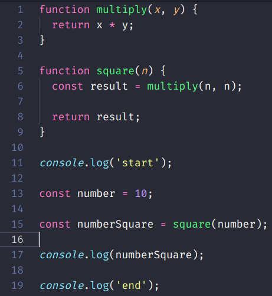
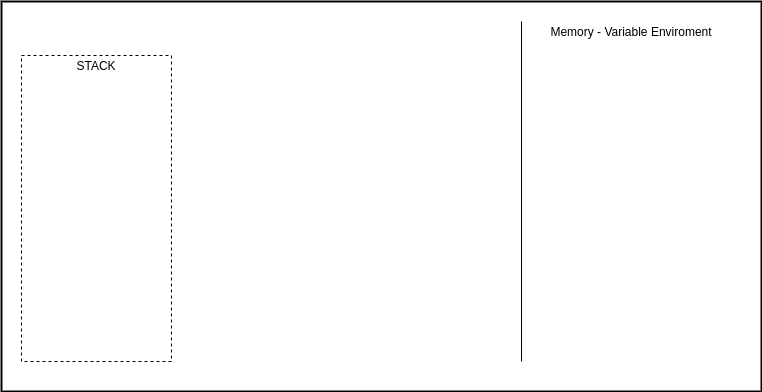
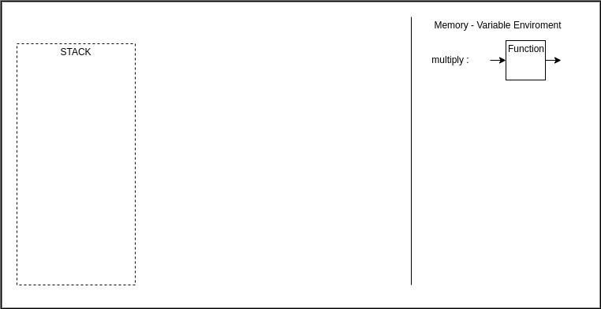
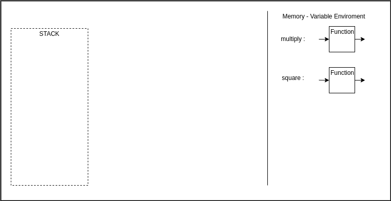
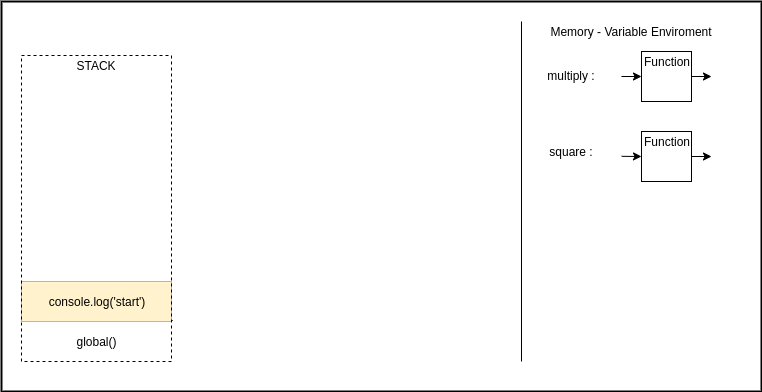

# Fundações do Javascript

## Javascript é _single thread_ (de uma só tarefa)

- isto uqer dizer que o ambiente de execução (_runtime enviroment_) possui apenas uma _call stack_, isto é, só pode realizar uma operação por vez.

Assim que iniciamos a execução do código, iniciamos "ambiente" de execução global, melhor dito, um _global execution context_, o contexto em que o código irá ser executado.

Exemplificando:

O nosso código

```js
function multiply(x, y) {
  return x * y;
}

function square(n) {
  const result = multiply(n, n);

  return result;
}

console.log('start');

const number = 10;

const numberSquare = square(number);

console.log(numberSquare);

console.log('end');
```

<div>
  
</div>

O código será executado no _global execution context_

<div>
  
</div>

1 - linha 1, o que acontece é que a função de nome `multiply` será colocada em memória no escopo global:

<div>
  
</div>

2 - a pŕoxima linha significativa é a nº 5. Nela uma outra função é "armazenada" na memória com o nome de `square`:

<div>
  
</div>

3 - a pŕoxima linha significativa é a nº 11. `console.log('start');` (vamos abstrair o que é console.log() e vamos considerar como o comando para escrever no console). como é um comando (código a ser executado) vamos colocá-lo na `STACK`

<div>
  
</div>

4 - `console.log('start');` na `STACK` é realizado e a mensagem escrita no console. Após a realização do comando o console.log() é retirado da `STACK` (é _popped out of the stack_)

<div>
  
</div>