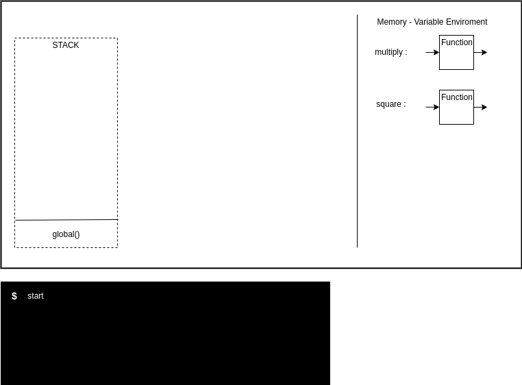
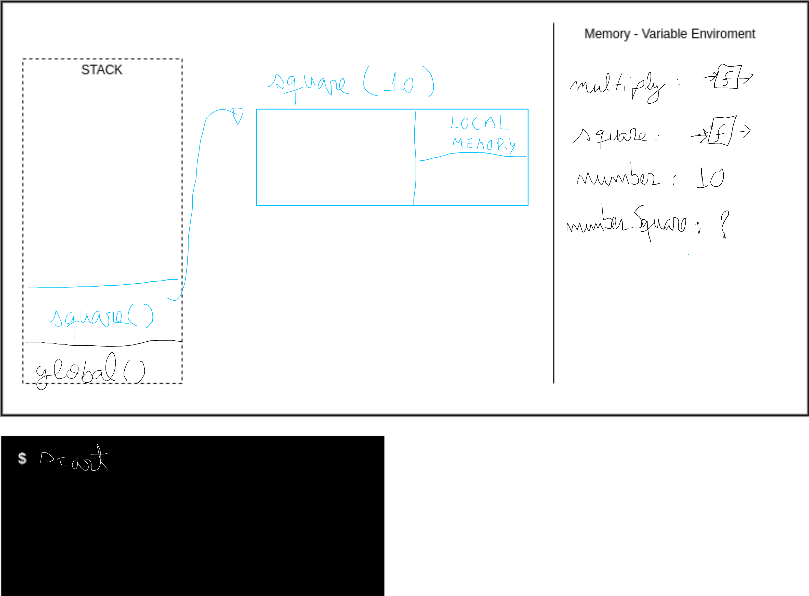
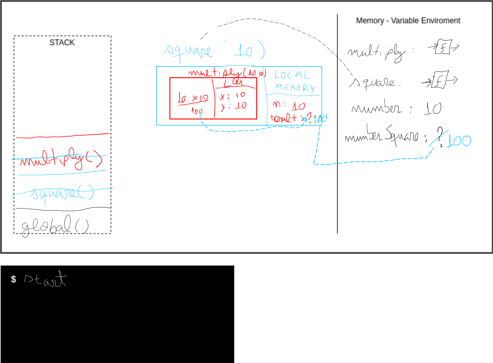
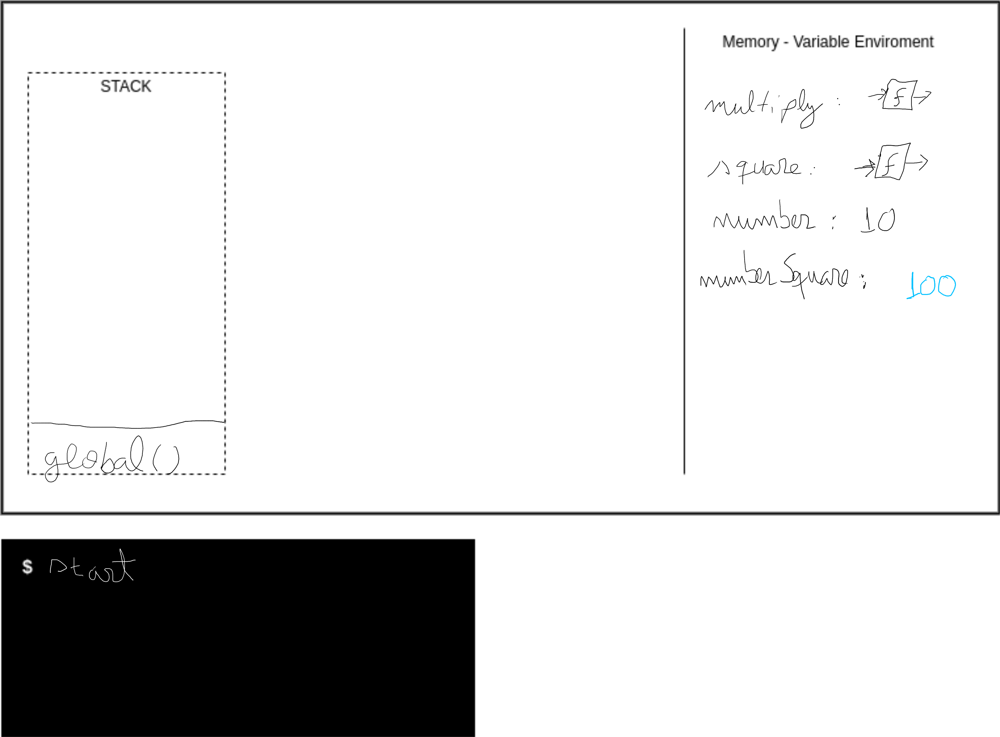
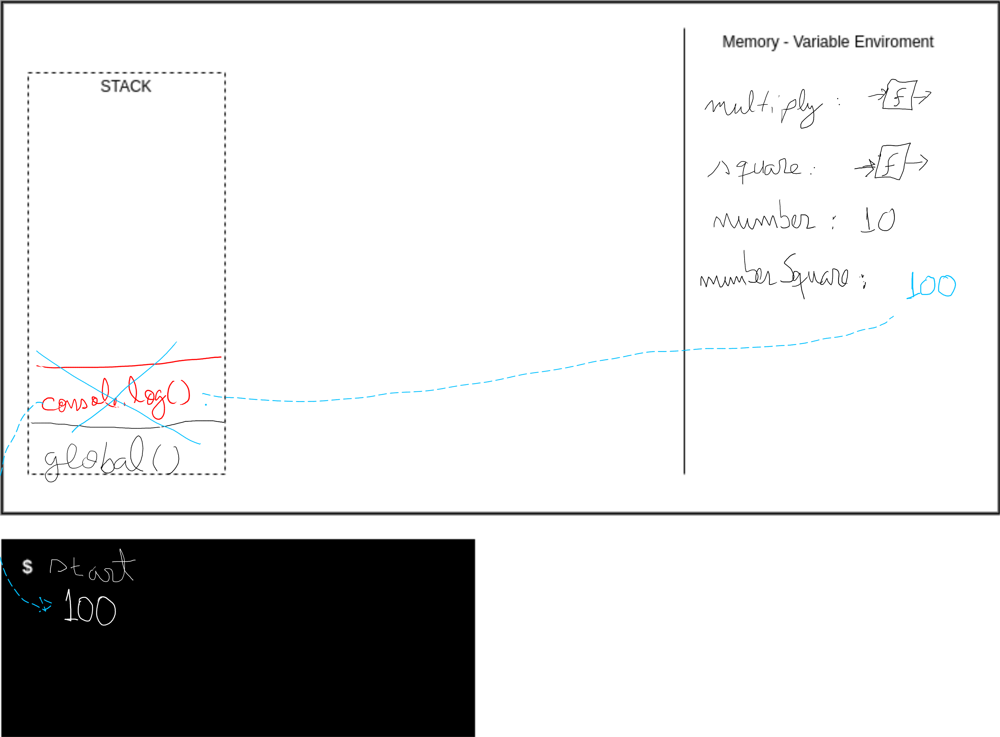
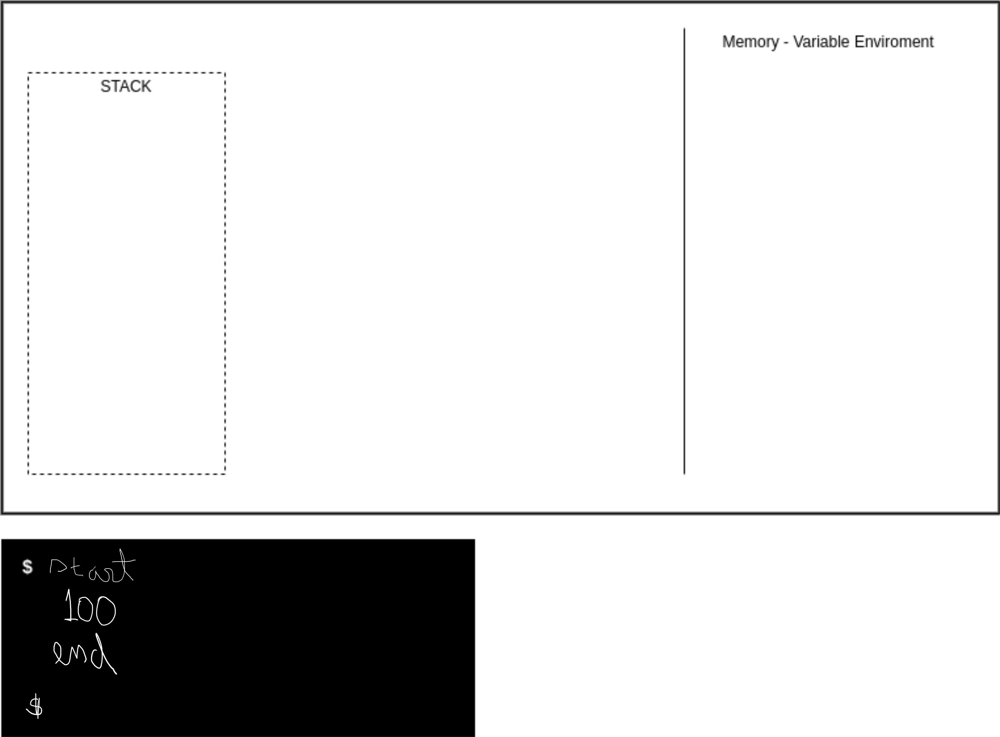

# Fundações do Javascript

## Javascript é _single thread_ (de uma só tarefa)

- isto quer dizer que o ambiente de execução (_runtime enviroment_) possui apenas uma _call stack_, isto é, só pode realizar uma operação por vez.

Assim que iniciamos a execução do código, iniciamos "ambiente", o contexto de execução global, melhor dito, um _global execution context_, o contexto em que o código irá ser executado.

Exemplificando:

O nosso código

```js
function multiply(x, y) {
  return x * y;
}

function square(n) {
  const result = multiply(n, n);

  return result;
}

console.log("start");

const number = 10;

const numberSquare = square(number);

console.log(numberSquare);

console.log("end");
```

<div>
  
</div>

O código será executado no _global execution context_

<div>
  
</div>

1 - linha 1, o que acontece é que a função de nome `multiply` será colocada na memória global:

<div>
  
</div>

2 - a pŕoxima linha significativa é a nº 5. Nela uma outra função é "armazenada" na memória com o nome de `square`:

<div>
  
</div>

3 - a pŕoxima linha significativa é a nº 11. `console.log('start');` (vamos abstrair o que é console.log() e vamos considerar como o comando para escrever no console). como é um comando (código a ser executado) vamos colocá-lo na `STACK`

<div>
  
</div>

4 - `console.log('start');` na `STACK` é realizado e a mensagem escrita no console. Após a realização do comando o console.log() é retirado da `STACK` (é _popped out of the stack_)

<div>
  
</div>

5 - a pŕoxima linha significativa é a nº 13. `const number = 10;` a variável de nome _number_ é criada e inicializada com o valor `10`;

6 - a pŕoxima linha significativa é a nº 15. `const numberSquare = square(number);` a variável de nome _numberSquare_ é criada e inicializada com o retorno da invocação da função `square`. Como a função `square` está sendo invocada, chamada (determinado pelo uso dos parêntesis), esta função é adicionada a `call stack`, em um _execution context_ é criado para a execução da função:

<div>
  
</div>

6.1 - a função `square` recebe como argumento o valor `10` este valor é atribuído ao parâmetro `n` dentro da `local memory` (no escopo da função) do seu `execution context`. A função `square` declara uma variável de nome `result`, que por sua vez recebe o retorno da chamada da função `multiply`, abrindo um novo _execution context_ dentro do anterior. A função `multiply` recebe dois argumentos, que são o valor de `n` que está na memória local do contexto de execução da função `square`...

6.2 - o processo se repete com a função `multiply` que ao retornar o valor `100` para a variável de nome `result` (dentro da memória local do contexto de execução da função `square`) é retirada da _call stack_...

6.3 - após a atribuíção do valor `100` à variável `result` a função `square` retorna o valor para a variável de nome `numberSquare` e é retirada da _call stack_:

<div>
  
</div>

7 - na linha 16 já temos a seguinte situação:

<div>
  
</div>

8 - na linha 17 adicionamos o `console.log(numberSquare)` à _call stack_ que após a sua execução será retirada da mesma:

<div>
  
</div>

9 - analogamente o mesmo acontece na linha 19, sendo impresso no console o valor `'end'`. Após a execução da última linha o programa termina e o contexto global de execução é retirado (e toda a memória liberada).

<div>
  
</div>
