# Fundações do Javascript

## A palavra `this`

- a palavra reservada `this` pode possuir diferentes valores, podendo ser: `undefined` (_mais rigorosamente o `this` neste caso não está inicializado, não existe_), o objecto global, o object window, o 'module.exports', ou um outro objecto criado.

- o `this`, também pode ter valores diferentes entre os modos _strict_ e não _strict_

https://www.ecma-international.org/ecma-262/10.0/index.html#sec-strict-mode-of-ecmascript

- If this is evaluated within strict mode code, then the this value is not coerced to an object. A this value of undefined or null is not converted to the global object and primitive values are not converted to wrapper objects. The this value passed via a function call (including calls made using Function.prototype.apply and Function.prototype.call) do not coerce the passed this value to an object (9.2.1.2, 19.2.3.1, 19.2.3.3).

# `this` referência o valor do `global object`

1 - quando usado dentro do _global enviroment_, `this` apontará para o `objecto global`:

<div>
  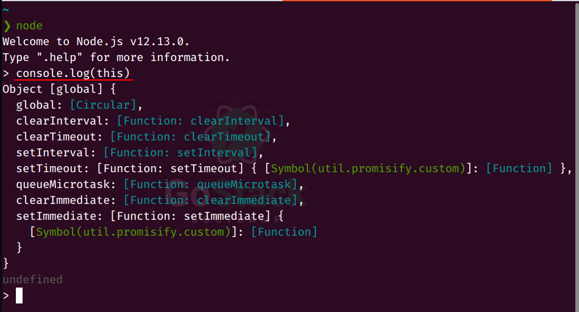
</div>

- repare-se que o console.log() foi chamado dentro do node

2 - (NO MODO **NÃO STRICT**) dentro de funções quando invocadas:

```js
// ./code/3.js
//"use strict";
//executed in global execution enviroment
function whoIsThis1() {
  console.log(this);
}

//executed in another function execution enviroment
function whoIsThis2() {
  (function teste() {
    console.log(this === global);
  })();
}
function whoIsThis3() {
  function teste() {
    console.log(this === global);
  }
  (function teste2() {
    teste();
  })();
}

whoIsThis1();
whoIsThis2();
whoIsThis3();
```

<div>
  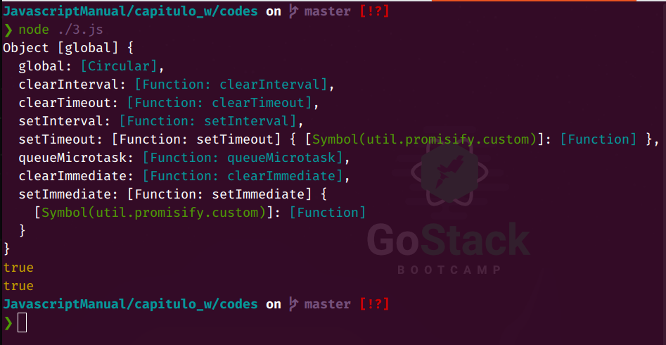
</div>

- **atenção que isso só é válido sem o uso do _strict mode_, mais abaixo tem os casos do `this` retornar `undefined`, mas para demonstrar, se adicionarmos o modo strict**:

```js
// ./code/3.js
"use strict";

function whoIsThis() {
  console.log(this);
}

whoIsThis();
```

<div>
  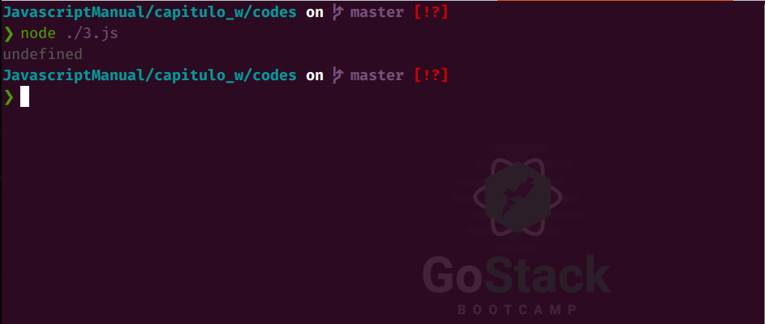
</div>

# `this` referência o valor do `module.exports`

- Dentro de um arquivo.js que será executado pelo node o `this` referência o module.exports.

```js
// ./codes/2.js
console.log("this dentro do arquivo que será executado");
console.log("this === global object", this === global);
console.log("o valor de this é", this);
```

<div>
  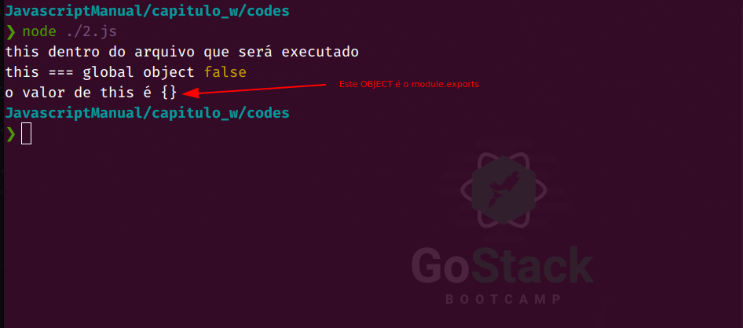
</div>

# `this` referência o valor do `window` do browser

- Executando o console.log(this) dentro do console do broswer, temos que o `this` referência o objecto `window`

<div>
  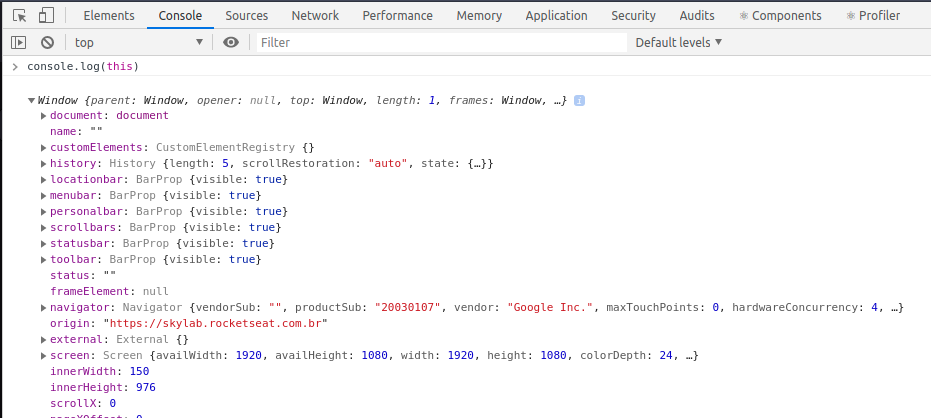
</div>

# `this` na chamada de um método é sempre o object a esquerda!

- qd usando pelo o objecto que o define

```js
const user = {
  name: "Carlos",
  age: 38,

  getMessage() {
    console.log(this);
    return `Olá ${this.name} você tem ${this.age} anos`;
  },
};

console.log(user.name);
console.log(user.getMessage());
```

<div>
  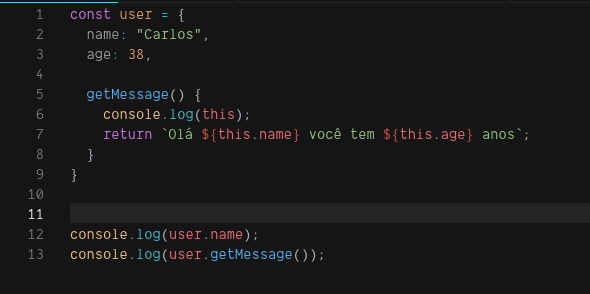
</div>

<div>
  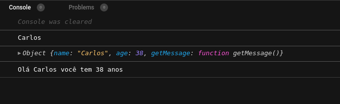
</div>

- qd usado dentro de um construtor de obectos o `this` será o próprio objecto

```js
function UserFactory(firstName, lastName, age) {
  this._firstName = firstName;
  this._lastName = lastName;
  this._age = age;

  this.getFullName = function () {
    console.log(this);
    return this._firstName + " " + this._lastName;
  };
}

const user = new UserFactory("Carlos", "Braz", 38);

console.log(user.getFullName()); //"Carlos Braz"
```

<div>
  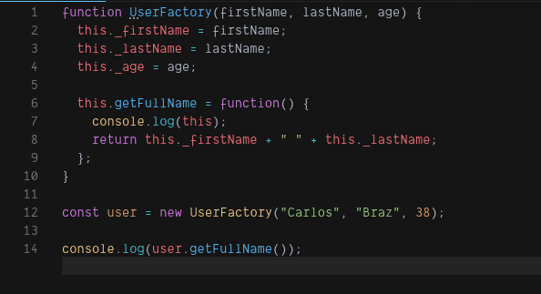
</div>

<div>
  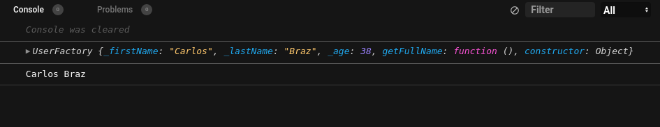
</div>

**Nota** a função é uma construtora e por convenção a primeira letra está em caixa alta. Isto é, esta função precisa ser chamada com a precedência da palavra reservada `new`. Caso o `new` seja omitido um erro será exibido pelo facto de como em qualquer função o `this` será `undefined` (_strict mode_) como visto anteriormente.

## But

- qual o valor do `this` quando usamos métodos tipo `map`, `forEach`, `filter`...

```js
const meuArray = [1, 2, 3, 4, 5];

meuArray.forEach((i) => {
  console.log(this);
});

const multiplyBy2 = meuArray.map((i) => {
  console.log(this);
  return i * 2;
});

console.log(multiplyBy2);
```

<div>
  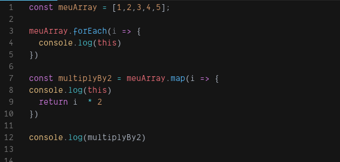
</div>

<div>
  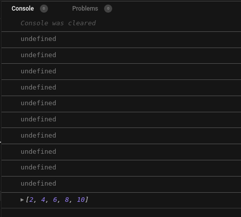
</div>

**Ué** mas não deveria ter o valor do objecto da esquerda???
No caso destes métodos vamos verificar a documentação do [MDN](https://developer.mozilla.org/pt-BR/docs/Web/JavaScript/Reference/Global_Objects/Array/filtro):

> var newArray = arr.filter(callback[, thisArg])

Ahhh... Os métodos `map`, `forEach`, `filter`... possum um último parâmetro que definirá o valor do `this`! Como na chamada dos métodos no exemplo acima passamos implicitamente o valor `undefined` como argumento ao parãmetro `thisArg` e daí seu valor ficar como `undefined`.

# Arrow functions

A referência [MDN](https://developer.mozilla.org/pt-BR/docs/Web/JavaScript/Reference/Functions/Arrow_functions) diz que:

> Uma expressão arrow function possui uma sintaxe mais curta quando comparada a uma expressão de função (function expression) e **não tem seu próprio this**, arguments, super ou new.target

(grifo meu)

**Nota** os exemplos abaixo foram executados em **_no stric mode_** para que o `this` tenha valores que possam ser verificados de forma mais fácil!

- primeiro exemplo:

```js
const user = {
  name: "Carlos",
  age: 38,

  getMessage: () => {
    console.log(this);
    return `Olá ${this.name} você tem ${this.age} anos`;
  },
};

console.log(user.getMessage());
```

Executando este código que está em um arquivo no node, sabemos que o `this` aponta para o module.exports.

Qual o valor do `this` dentro da arrow function?

<div>
  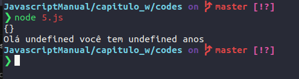
</div>

Como as Arrow Fucntions não possuem o `this` e o `this`, também segue a cadeia de protótipos o próximo `this` é o do escopo do arquivo, ou seja, o module.exports.

### outro exemplo

```js
function soma(a, b) {
  console.log("Soma", this);

  const total = () => {
    console.log("Total", this);
    return a + b;
  };

  return total;
}

console.log(soma(1, 2)());
```

- como as arrow functions não possuem o `this`, o `this` dentro da arrow function (total) terá o mesmo valor do `this` da função soma. Como o valor do `this` na função soma é o `global object` o valor do `this` em total também será o `global object`.

## **Como que a arrow function guarda esse valor ou como que afirmamos que o `this` será definido em tempo de execução vai ser discutido na parte sobre closures**
