# Fundações do Javascript

<div align="center">
  
</div>

# O "significado" do `this`

- Antes de começar: caso já possua conhecimento formado sobre a palavra `this` proveniente de outras linguagens de programação, **não associe** esse conhecimento com o significado do `this` no javascript.

<div align="center">
  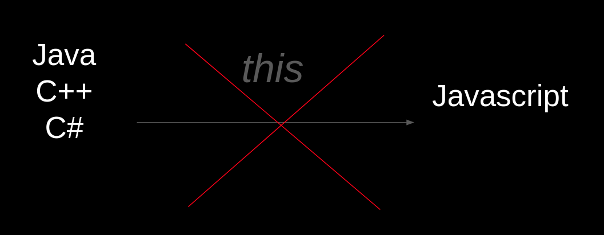
</div>

## Características do `this`

- é uma palavra reservada
- é afetada pelo o uso do _strict mode_: o `this`, pode ter valores diferentes entre os modos _strict_ e não _strict_

[https://www.ecma-international.org/ecma-262/11.0/index.html#sec-strict-mode-of-ecmascript](https://www.ecma-international.org/ecma-262/11.0/index.html#sec-strict-mode-of-ecmascript)

> If this is evaluated within strict mode code, then the this value is not coerced to an object. A this value of undefined or null is not converted to the global object and primitive values are not converted to wrapper objects...

- em _no strict mode_ será sempre um `object`
- em _strict mode_ pode assumir os valores de `undefined`, `null`, `object` ou de um valor primitivo

\*\* no caso do _no strict mode_ nas situações em que o `this` for `undefined` ou `null` o `this` terá seu valor convertido para o `global object` (ou `window`). No caso do `this` for um valor primitivo (`string`, `number`, `boolean`) terá seu valor convertido para o respectivo Objecto _Wrapper_ (`String`, `Number`, `Boolean`).

- terá seu valor atribuído (_bounded_) no momento em que o contexto de execução for gerado - seu valor é, portanto, **dinâmico**

O `this` está diretamente relacionado com o contexto de execução, que é o espaço reservado para a execução de código enquanto a função estiver presente na _call stack_. Metaforicamente seria algo assim:

<div align="center">
  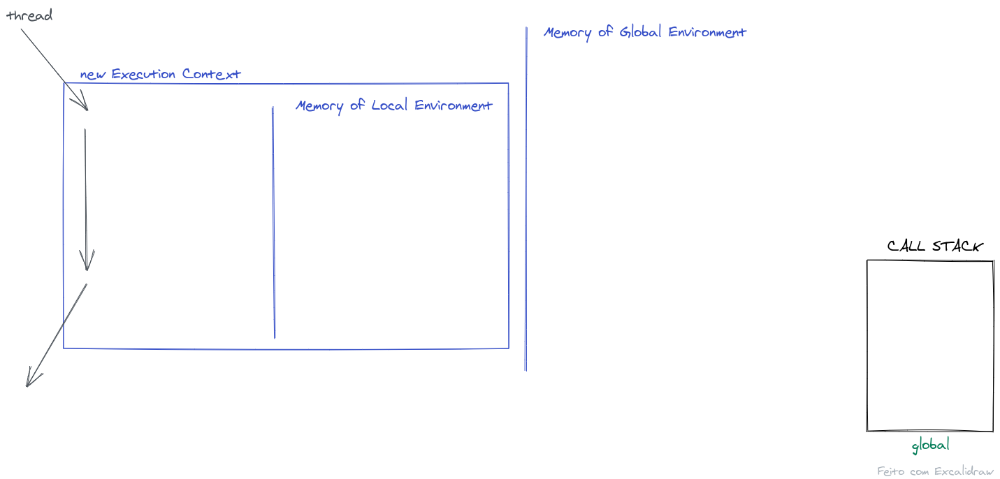
</div>

- toda `Function` quando executada cria um contexto de execução. Dentro desse contexto de execução é que surge o `this`, e este estará ligado a um valor ou será `undefined`, a depender de como executamos a função (que gerou o contexto de execução).
- cada contexto de execução exite apenas, e unicamente, para uma `Function`, no entanto, "dentro" (_metaforicamente_) de um contexto de execução é possível ter outros contextos de execução. Mas cada um pertencente a uma `Function` que existirá pelo tempo que essa `Function` estiver na _call stack_.

### O mais importante aqui, para o `this`, é que este está relacionado com o contexto de execução e, portanto, seu valor só será atribuído no momento em que o código estiver sendo executado.

## Para prever o valor do `this` temos de olhar para o contexto de execução e, principalmente, para **COMO** a função está sendo executada (chamada, invocada).

## Sequindo nesse raciocínio vamos verificar de que forma (COMO) podemos executar uma função em javascript: existem 4 formas possíveis.

1 - usando os parêntesis () em uma definição de função;

2 - usando os parêntesis () em uma propriedade `Function` de um `object`;

3 - usando o `call` ou `apply`; e

4 - usando o operador `new`.

---

# 1º Invocando uma função com os parêntesis:

<div align="center">
  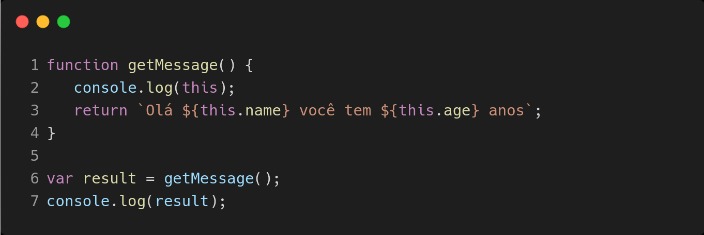
</div>

- Ao executar a fução `getMessage` na linha 6, adicionando os parêntesis no identificador da função. A função será adicionada à _call stack_ e um novo contexto de execução será criado. Dentro deste contexto existe uma área de variáveis locais e um identificador chamado `this`, sempre que um contexto de execução é criado o `this` está lá, presente (_excepto na arrow functions_ - mas deixe isso para vermos mais à frente).

- Ora, se existe nesse contexto um identificador chamado `this`, para que valor estará ele apontando? Qual o seu valor? Neste caso o seu valor será `undefined`, pois nada foi ligado a ele!

<div align="center">
  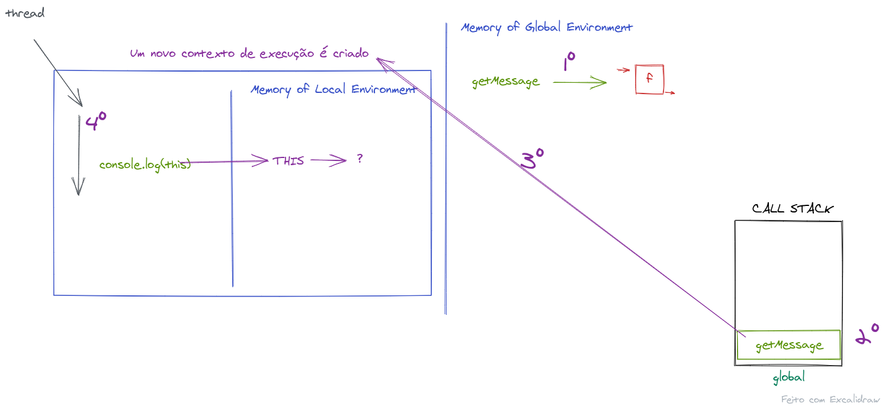
</div>

- recapitulando:

1º - a definição da função `getMessage` é salva em memória no "espaço" global;
2º - ao chamar a função, esta é adicionada à _call stack_
3º - um novo contexto de execução é criado.
... (abrastraindo o que acontece com o console.log)
4º - o código precisa do valor do `this` e "procura" este identificador no "espaço" de variáveis locais desse contexto de execução.... e o `this` é encontrado!

- hum... mas qual o valor do `this`. Se não há um... então é `undefined`!

(repare que neste momento não há questionamentos sobre o _scope_ que confunde muitas vezes a previsão do valor do `this`. Meu conselho é: tire a idéia do _scope_ da inferência do valor do `this`)

- Ok. Então `this` é `undefined`. (ponto)
- Mas... Este código está sendo **executado em modo estrito**? (usando o _"use strict"_). Pois como vimos **se estiver**, não ocorre mais nada e o `this` é tratado como `undefined` e seguindo a função `getMessage` a palavra `undefined` surge no monitor, ao passar para a execução do pŕoximo comando, e estando em modo estrito, e sendo o `this` `undefined` o `this.name` irá disparar um error (um TypeError) porque `undefined` não tem propriedades!

Mas... este código de exemplo **não está usando o modo estrito** então o valor que encontramos para o `this`, o valor `undefined`, será convertido (no momento do tratamento deste valor do `this`) para o `global object` (ou `window`).

Pronto, o `this` foi facilmente previsto caso invoquemos a função com os parêntesis! Este é o _default binding_ do `this`.

---

## Antes de prosseguir seria interessante executar o código acima no node e no browser e ver o resultado acontecendo.

- para usar o modo estrito, pode ao definir a função `getMessage` pode usar fazer da seguinte maneira:

```js
function getMessageStrictMode() {
  "use strict";
  console.log(this);
  console.log(`Olá ${this.name}!`);
}
```

---

# 2º Invocando uma função referenciada em uma propriedade de objecto com os parêntesis:

<div align="center">
  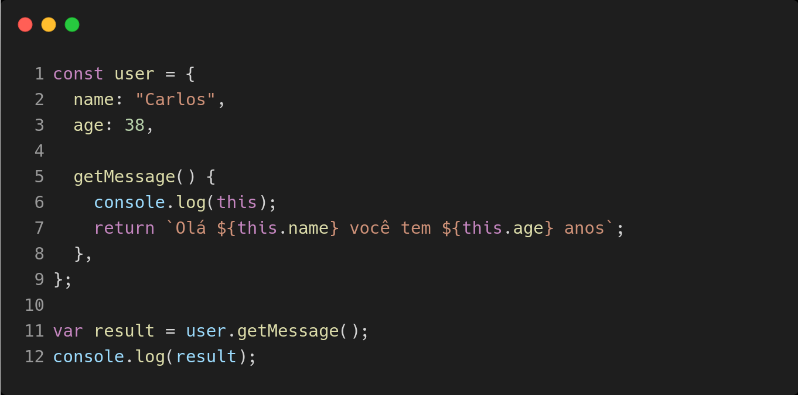
</div>

<div align="center">
  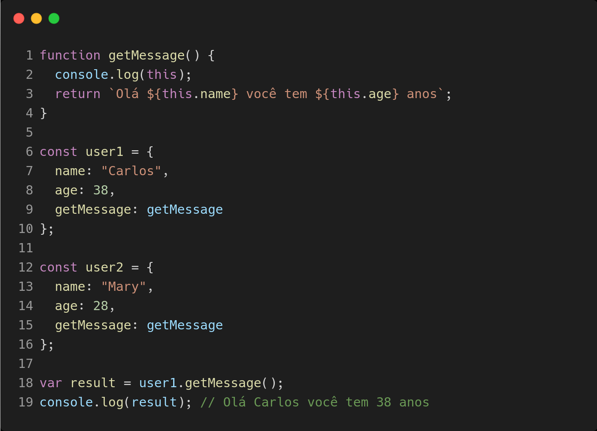
</div>

- nos dois casos acima o resultado será o mesmo **SE** a forma como invocarmos a função `getMessage` for assim:

```js
user.getMessage();
```

- pois desta forma, estamos indicando para a função `getMessage` que no momento da sua execução o `this` no seu contexto deverá ser ligado ao valor do `user`.

<div align="center">
  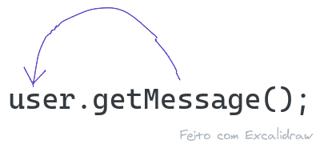
</div>

- como `user` é um `object` a escolha do modo estrito ou não estrito não fará diferença quanto ao valor do `this`.

Pronto, o `this` foi facilmente previsto caso invoquemos a função referenciada por meio de um objecto! Este é o _implicit binding_ do `this`.

---

# 3º Invocando uma função usando o `call` ou `apply` (e o `bind`):

<div align="center">
  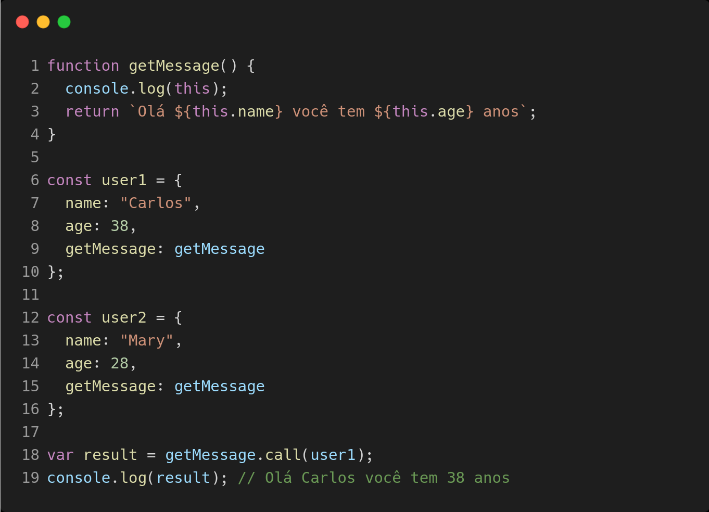
</div>

- o `call` e o `apply` são extremamente semalhantes e na questão do `this` irão funcionar de forma idêntica.

- Quando usamos o `call` ou o `apply` estamos indicando que a função deverá ser executada, e que no contexto de execução criado o `this` deve ser ligado (_bounded_) ao valor que for passado como primeiro argumento do `call` ou do `apply`.

- Novamente, quando o valor for usado, e, caso esteja correndo em modo não estrito, **SE** o valor for `undefined`, `null` ou um valor primitivo o `this` terá esse valor convertido para, por exemplo, o `global object` (nos casos de `undefined` ou `null`).

Pronto, o `this` foi facilmente previsto caso invoquemos a função ao mesmo tempo em que apontamos qual o valor do `this`! Este é o _explicit binding_ do `this`.

## em relação ao `bind`

- no caso do `bind` não estamos invocando a função. **Não se trata de uma forma de chamar uma função!**

- Mas temos de incluir aqui porque o `bind` é uma função que irá alterar o comportamento da chamada da função onde ele é aplicado.

<div align="center">
  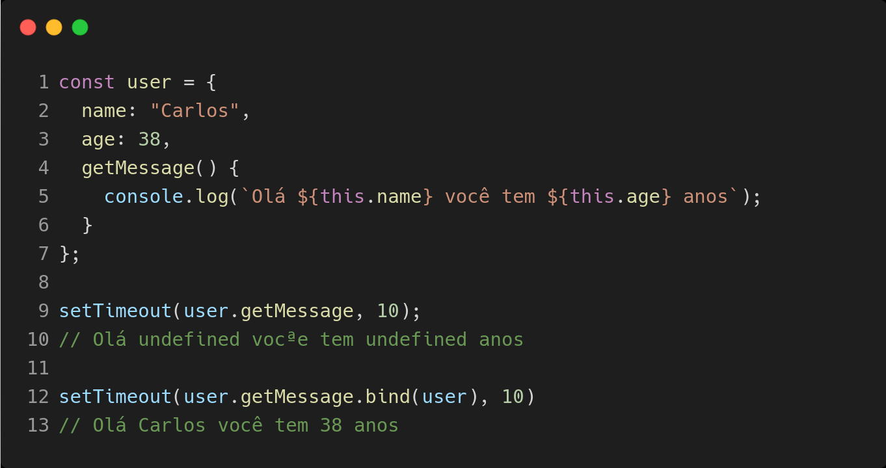
</div>

- No nosso exemplo, quando escrevemos `user.getMessage` isto está referenciando uma definição de função e com esta definição de função aplica-se o `bind` - `user.getMessage.bind(...)`. Da execução do `bind` uma nova função é retornada, ela possui **a mesma definição** que a função original (aquela referenciada pelo `user.getMessage`) mas com uma informação extra (ela será uma `Function` com um _bound_). Essa informação será responsável pelo valor do `this` quando e somente no momento que esta função for invocada.

- o uso do `bind` é um _hard binding_ do valor do `this`.

---

# 4º Invocando uma função usando o operador `new`:

- para a funcionalidade do operador `new` veja este [link](../capitulo_v/cap_v_sec_2.md)

- Aqui no estudo do `this`, ficaremos com a primeira coisa que o operador `new` faz, que é a criação de um novo `object` dentro do contexto de execução da função invocada e a associação desse novo `object` ao `this`.

- Portanto com o uso do operador `new` o `this` sempre será ligado a um novo `object`.

<div align="center">
  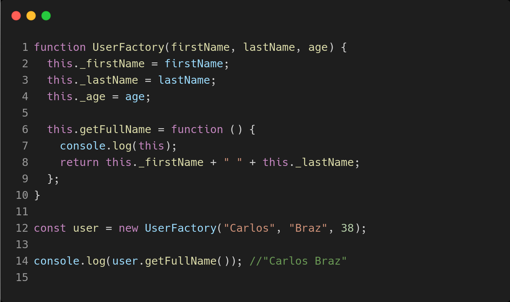
</div>

---

# Resumindo, para prevermos o `this` precisa-se saber como a função será executada.

- Seguindo a seguinte ordem podemos inferir o valor do `this`, entaõ:

### A) A função está sendo executada como o operador `new`?

Se sim, é certo que o `this` será ligado ao novo `object` criado dentro do contexto de execução.

### B) A função está sendo executada com `call`, `apply` (ou `bind`)?

Se sim, então o `this` será ligado ao valor explicitamente passado como argumento das funções `call`, `apply` (ou `bind`).

_o `bind` **não** é uma forma de invocar uma função!_

### C) a função está sendo invocada e referenciada por meio de um `object`?

Se sim, então o `this` será ligado ao valor do `object` da esquerda (do '.').

### D) a função está sendo invocada com o uso dos parêntesis?

Se sim o `this` não receberá nenhum valor e portanto será `undefined`.

### \*\* Hum e o código da função está sendo executado em que modo?

Se no modo estrito (_"use strict"_) o valor do `this` será mantido como `undefined`, `null`, valor primitivo ou `object`.
Caso esteja no modo não estrito o valor do `this` será sempre um `object` e para isso, caso o valor seja `undefined` ou `null` este será convertido para o valor do `global object`. No caso de valor primitivo será convertido para o correspondente `object` _wrapper_.

---

# Agora em relação às Arrow Functions

## para falarmos das Arrow Functions só precisamos adicionar uma informação ao que foi dito até agora.

## As Arrow Funtions não possuem `this` no contexto de execução que criam.

- What? :confused:

- Vamos ver o que diz a [_spec_ item 14.2.17](https://www.ecma-international.org/ecma-262/11.0/index.html#prod-ArrowFunction):

> An ArrowFunction does **not define local bindings for** arguments, super, **this**, or new.target. **Any reference to** arguments, super, **this**, or new.target **within an ArrowFunction must resolve** to a binding in a **lexically enclosing** environment. [...]

(grifo meu)

## Então o que que acontece quando usamos o `this` dentro da definição de uma Arrow Function?

- **erradamente tive, durante muito tempo, a tendência de querer usar a Arrow Function para resolver um problema como no exemplo abaixo:**

- eu queria fazer isto como na linha 10:
<div align="center">
  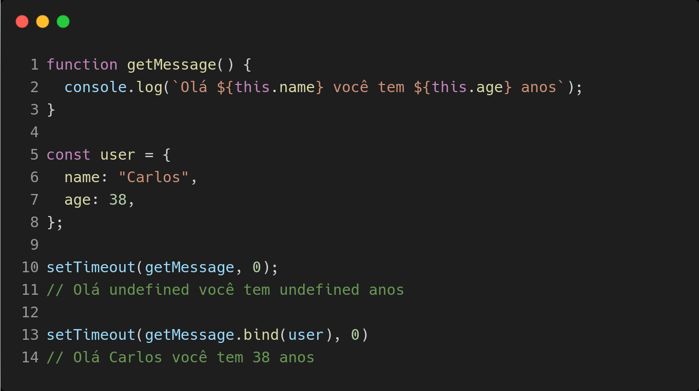
</div>

- e ficava frustrado porque isso não funciona como já vimos.

- daí mudava a função para uma Arrow Function:

<div align="center">
  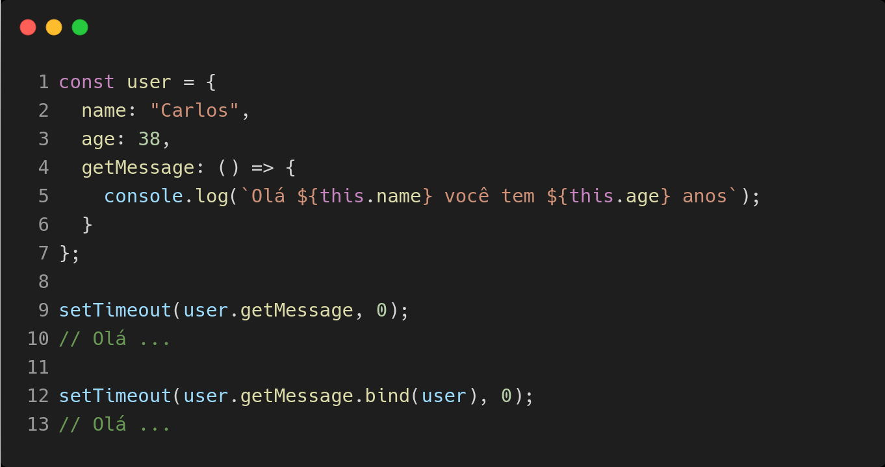
</div>

- e o pior de tudo...

- também não funcionava! O retorno continuava sendo:

```js
Olá undefined você tem undefined anos
```

Pior ainda. Até usando o `bind` (que antes funcionava) agora já não funciona!

### quer dizer que o `this` dentro da Arrow Function não é o que eu acho que é!

### hum... vamos lá ver o que ele é:

- ao correr o código da imagem anterior um `object` com o _label_ `user` será colocado em memória no _scope_ global, assim como suas propriedades;
- na definição de uma função, seja ela arrow function ou não, esteja ela referenciada por uma variável ou por uma propriedade de `object`, o _scope_ da _outer_ `function` ficará "fechada" na função, no nosso caso na arrow function...

- Para mais detalhes sobre as closures acesse este [link](./cap_w_sec_3.md);

- **lembremos** que as arrow functions não possuem o `this` dentro do seu contexto de execução! E por não possuirem o `this` a _spec_ diz que: ao usarmos o `this`dentro da definição da arrow function, este será resolvido como uma variável normal, ou seja, será resolvido pelo escopo estático da função! Hum... mas `this` estático? Sim neste caso como as _arrow functions_ não possuem o `this` a sua referência será resolvida estaticamente. E como a _arrow funtion_ tem uma _closure_ é lá que iremos procurar uma referência ao `this`. Este `this` que está _closed_ à arrow function é um `this` normal e, portanto, continua sendo dinâmico e dependendo da forma como a função é invocada.

- ao executar o código acima seria mais ou menos isto:

<div align="center">
  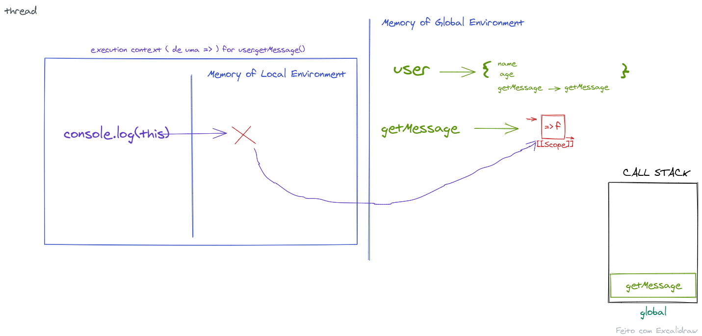
</div>

- não havendo `this` no contexto de execução da arrow function ele será resolvido dentro do [[Scope]], que no caso coincide com o do global context. Daí o `this` ter o valor `undefined`. Sendo `undefined` aplicamos a conversão ou não, para o objecto global, dependendo se a função está sendo executada em modo estrito ou não.

## um outro exemplo de uso e que teria sentido o uso da _arrow funtion_ seria o sequinte:

<div align="center">
  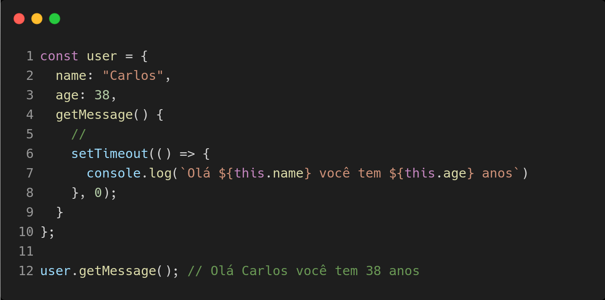
</div>

- já sabemos que o `this` dentro da _arrow function_ será resolvido estaticamente. Ele fica amarrado ao `this` da função envolvente.

- Ma so `this` do `getMessage` continua sendo dinâmico e vai ter eu valor dependente da forma como esta função é invocada, assim:

```js
user.getMessage();
```

- quando executado, no contexto de execução do `getMessage` o `this` é ligado ao valor do `user` e como o `this` da _arrow function_ ficou amarrado a este estaticamente. Quando o `setTimeout` invocar a _arrow function_ (a _callback_) o `this` estará amarrado estaticamente e o seu valor será o mesmo do `this` do `getMessage`, que no caso será o _object_ `user`.

# Ok! this ends now!

- [link para o video no youtube](https://youtu.be/MmT-Qydqo3Q)
