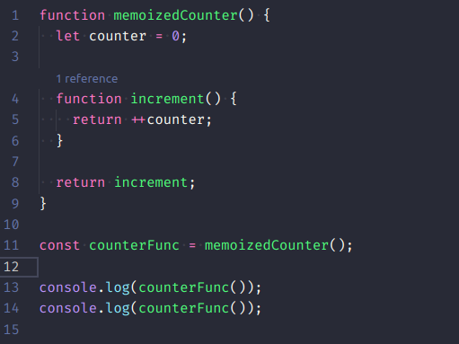
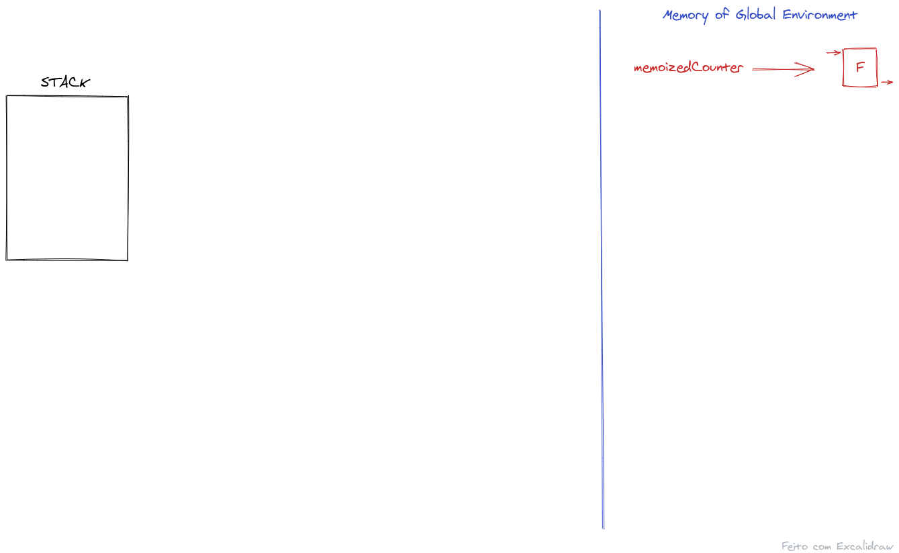
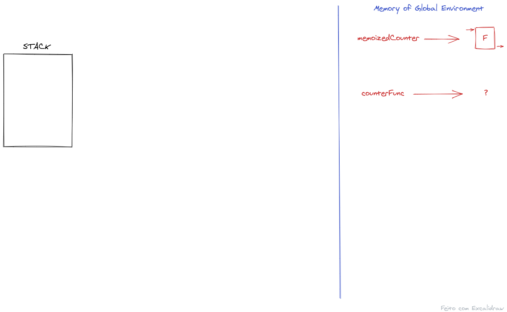
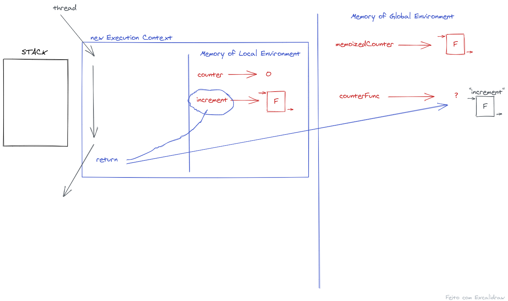
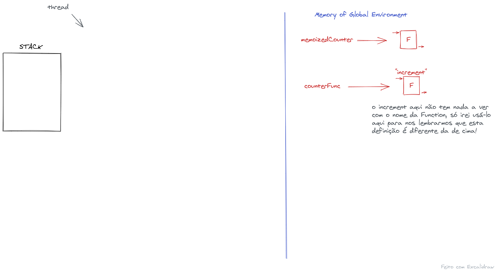
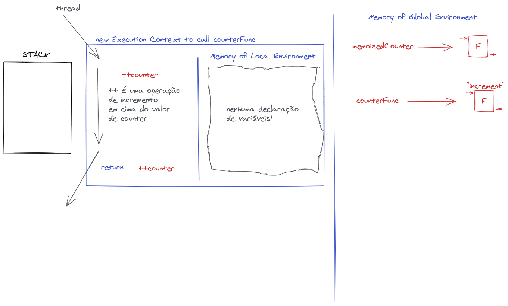
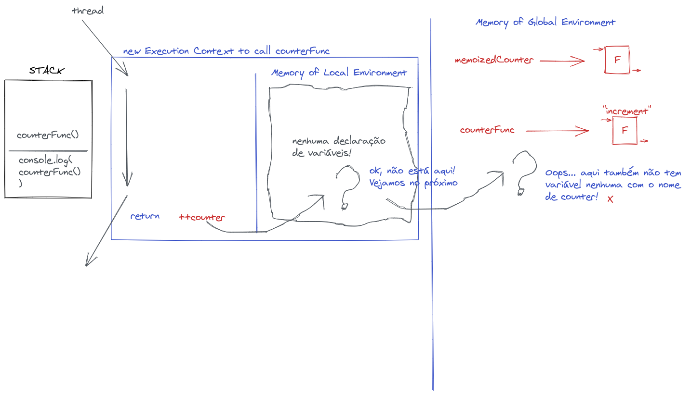
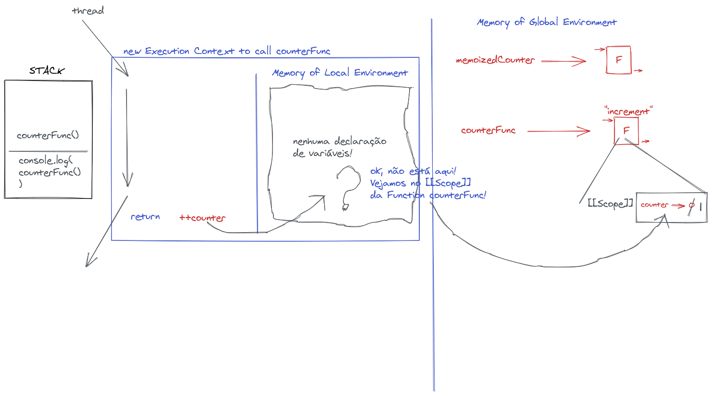
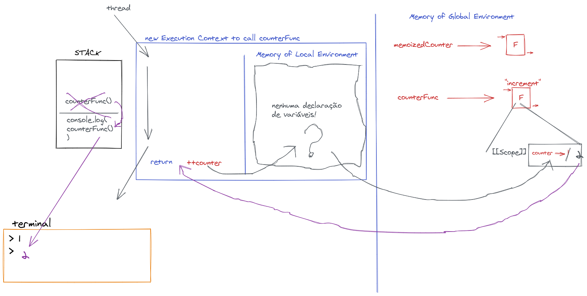
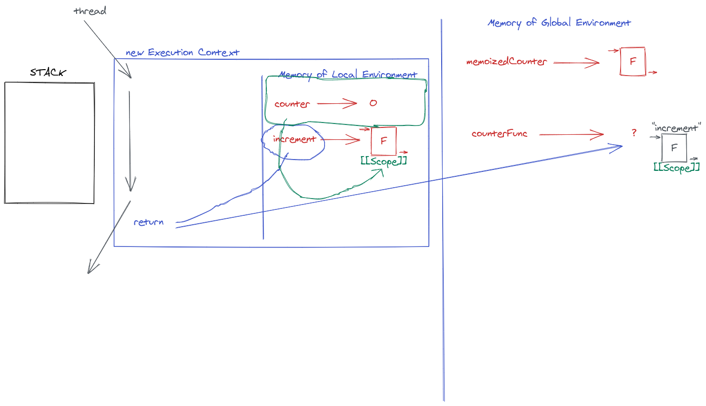

# Fundações do Javascript

## Closure

- C.L.O.V.E (Closed Over Variable Environment);
- P.L.S.R.D (Persistent Lexical Scope properties Referenced Data).

https://www.ecma-international.org/ecma-262/5.1/#sec-15.3

> A lexical environment that defines the environment in which a Function object is executed. Of the standard built-in ECMAScript objects, only Function objects implement [[Scope]].

### Closure está presente na esmagadora maioria dos nossos códigos, o fato de javascript SER "Closure" é que permite funções usarem `data` definidos no `scope` de fora.

### NOTA: a interpretação a seguir NÃO retrata ao pé da letra (num sentido estrito) como a _engine_ do javascript funciona, mas é SUFICIENTE para sedimentar o modelo mental de como é o seu funcionamento. Por favor leve isto em consideração e leve em conta que, no meu entendimento, a forma como é demonstrado facilita o entendimento e pode ser aplicado como se na realidade se tratasse dessa forma!

## Sem pensar em Closure vamos ver o que acontece ao executar o código abaixo:

```js
function memoizedCounter() {
  let counter = 0;

  function increment() {
    return ++counter;
  }

  return increment;
}

const counterFunc = memoizedCounter();

console.log(counterFunc()); // 1
console.log(counterFunc()); // 2
}
```

<div>
  
</div>

- o resultado da execução desse código são as saídas `1` e `2`.

Vejamos:

Ao executar esse código o javascript irá definir no ambiente (_environment_) global uma `Function` (a definição das linhas 1 a 9)

<div>
  
</div>

Na linha 11 irá definir uma variável de nome `counterFunc` que irá receber "?", pois só após a execução da função `memoizedCounter` é que saberemos.

<div>
  
</div>

Para que possomas passar para a linha 12, **primeiro** temos de executar a função `memoizedCounter`

 <div>
  
</div>

- para executar esta função um novo contexto de execução será criado, e dentro dele um espaço reservado para as variáveis locais.

Ao executar a definição da função `memoizedCounter` primeiro criamos uma variável de nome `counter` e atribuímos o valor de `0`. De seguida criamos a variável de nome `increment` e atribuímos a definição de uma `Function`. Ao termino da execução da `memoizedCounter` o `return` foi definido para o valor de `increment` e, portanto, a definição dessa `Function` será atribuída à variável `counterFunc` do Global Environment.

Quando a _thread_ terminar o retorno o `return` ela deixa esse _Execution Context_ e passa para a linha 13 (linha 12 está vazia)

- Esse contexto de execução que foi criado para a execução da função `memoizedCounter` deixa de existir, é varrido da memória, não ficando um restício da sua existência.

 <div>
  
</div>

Na linha 13 temos o `console.log` vou abstrair ele e considerá-lo apenas um artifício para exibir o valor de retorno da função `counterFunc` (o retorno da execução)

Assim como foi feito na execução da função anterior, vamos criar um novo contexto de execução para a chamada de `counterFunc`

 <div>
  
</div>

A _thread_ não tem declarações a fazer de acordo com a definição da função a ser executadad, portanto, o _local environment_ "não" possui valores!

Ao chegar no fim da definição o `return` da `Function` foi definido para retornar o valor de `++counter` (o valor de `counter` incrementado)

## **Oops**.... `counter`? Mas `counter` não existe no _local environment_

## Ok, vamos ver se existe no `scope` superior (_outer scope_)?

 <div>
  
</div>

## Ué, olhando assim parece que deveria dar Erro, mas já vimos que não há erro, na verdade, já vimos que o retorno é 1 e depois 2, mas onde está a variável `counter` para que eu possa pegar seu valor?

## `counter` existe, só que não se encontra nem no _local environment_ nem no _global environment_, `counter` está _closed_ (fechada) (persisted) na definição da função `counterFunc`!

- todas os _object function_ no javascript possuem uma propriedade inacessível chamada `[[Scope]]`

https://www.ecma-international.org/ecma-262/5.1/#sec-15.3

> A lexical environment that defines the environment in which a Function object is executed. Of the standard built-in ECMAScript objects, only Function objects implement [[Scope]].

Hum... então apesar de nós não conseguirmos acessar esse `[[Scope]]` o javascript consegue! E é lá que ele irá procurar a variável `counter` (não tendo sido uma definida no _local environment_, como é o nosso exmplo)

Então a imagem abaixo retrata mais corretamente a "procura" pela variável `counter`

 <div>
  
</div>

Em encontrando essa variável ela será então incrementada e seu valor retornado ao `console.log` que por sua vez irá exibir esse valor no "terminal"

- `console.log()` será removido da `call stack` e passamos à linha 14

Um novo `console.log` será chamado com o valor que retorna da execução de `counterFunc`. Um novo contexto de execução será criado e semelhante à situação anterior iremos "usar" a variável `counter` contida (fechada) dentro do `[[Scope]]` da definição da função `counterFunc`. Como este valor é _persited_ (gravado) o valor agora da variável `counter` é 1, que sendo incrementado passa a 2, valor este retornado para o `console.log` e então exibido no terminal.

 <div>
  
</div>

Após a exibilção do valor 2 no terminal a execução do código termina.

## Ok, então `counter` encontrava-se _closed_ no `[[Scope]]` da **definição** da função `counterFunc`!

Na **definição da função**.... Hum, então o `[[Scope]]` é determinado pelo momento da sua definição? Mas em que momento definimos está função que será atribuída a `counterFunc`?

 <div>
  
</div>

### - momento de definição da `Function` `increment` e atribuição do seu valor à variável `counterFunc`

- è neste momento que o espaço da _local environment_ fica _closed_ à `Function`

 <div>
  
</div>

## That's it! Closed!
