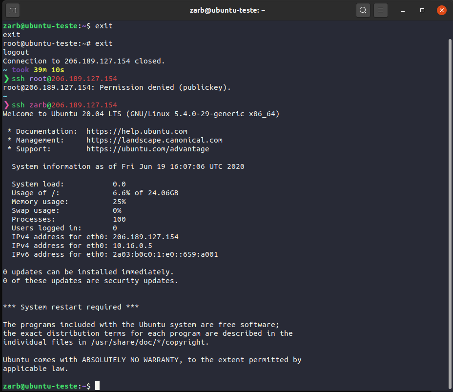
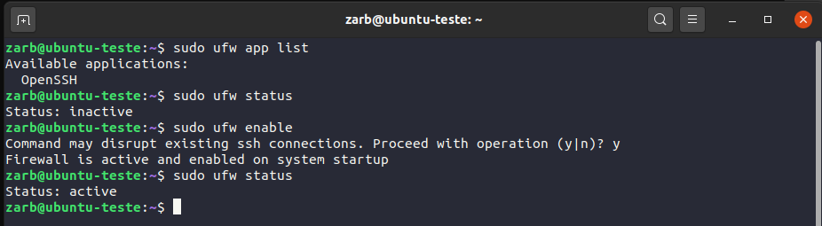
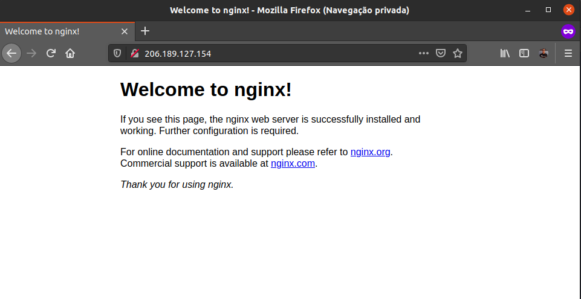
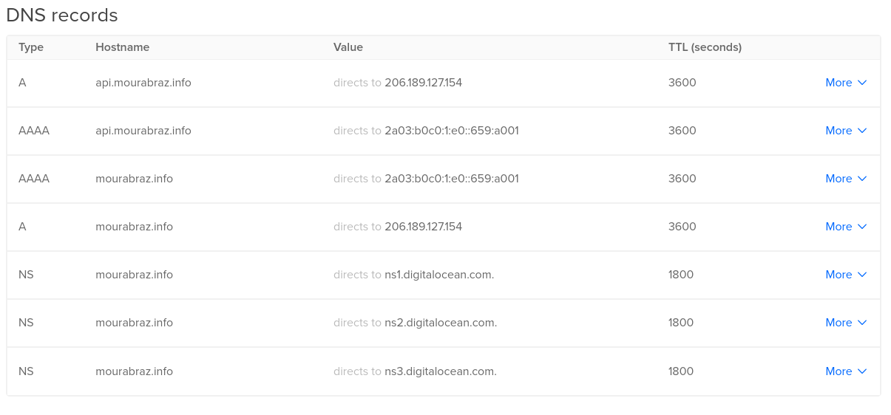

# Setup Ubuntu Server on Digital Ocean for backend and frontend deploy

- Node
- PM2
- Nginx
- Certbot
- Postgres
- Redis

## 1. Create a droplet on digital ocean

- with your account,
- chose Ubuntu 20.04 LTS,
- seletc IPv6,
- chose authentication access by ssh keys:
  > "Droplets that use SSH keys have password authentication disabled by default. This makes them secure against brute-force attacks."

## 2. Get in you server and update:

```
ssh root@206.189.127.154
```

if necessary add the new ip to your know hosts. Type yes and enter

<div align="center">
  
</div>

```bash
sudo apt update

//then

sudo apt upgrade
```

## 3. Create a new user with sudo privilegies

```
adduser zarb
```

<div align="center">
  
</div>

**set password:**
you can use this command to get one

```
openssl rand 15 | openssl base64 -A
```

### set sudo privilegies to the new user

```
usermod -aG sudo zarb
```

### Log as the new user

```
su zarb
```

<div align="center">
  
  </div>

### Copy ssh key

- in order to have ssh access with the new user we must copy the ssh key from root to the new user (the root key was set by digital ocean panel when we create the droplet)

- create the directory

```
mkdir /home/$USER/.ssh
```

- make directory only executable by the user

```
chmod 700 /home/$USER/.ssh
```

 <div align="center">
  
</div>

- copy the ssh key

```
sudo cp /root/.ssh/authorized_keys /home/$USER/.ssh/authorized_keys
```

- make everything in .ssh owned by the new user

```
sudo chown -R $USER:$USER /home/$USER/.ssh
```

- make it readable only by the new user

```
sudo chmod 600 /home/$USER/.ssh/authorized_keys
```

 <div align="center">
  
</div>

### Verify `sshd_config`

```
sudo nano /etc/ssh/sshd_config
```

 <div align="center">
  
</div>
 <div align="center">
  
</div>

- set PermitRootLogin no
- set PasswordAuthentication no (already set as 'no')

**before save and restart ssh service make sure you can log in the server as the new user with you ssh key**

To save changes press `Ctrl+x`, press `y` and `enter`

- restart ssh service

```
sudo systemctl restart ssh
```

- exit from the new user and exit from root
- try login with root
- login as the new user

 <div align="center">
  
</div>
 <div align="center">
  
</div>

## 4. Verify `ufw` (firewall)

```
sudo ufw app list
```

 <div align="center">
  
</div>
 <div align="center">
  
</div>

- allo OpenSSH

```
sudo ufw allow OpenSSH
sudo ufw status
```

 <div align="center">
  
</div>

## 5. Install Postgres

```
sudo apt install postgresql postgresql-contrib
```

### create new user for postgres

```
sudo -u postgres createuser --interactive
```

- I follow with the same name for the new user on postgres
 <div align="center">
  
</div>

- change config on pg_hba.conf (`12` is the postgres version)

```
sudo nano /etc/postgresql/12/main/pg_hba.conf
```

 <div align="center">
  
</div>

- set a password for the new postgres user

```
sudo su postgres
```

```
psql
```

```
ALTER USER zarb WITH PASSWORD 'zarb';
```

- then exit from psql, exit form postgres user

**When install popstgres by ubuntu repository. The new instalation will only accept localhost conections by default**

- we will proced this way. More late we will conect to our database using a ssh thunel.

## 6. Install redis

```
sudo apt install redis-server
```

- set a config parameter

```
sudo nano /etc/redis/redis.conf
```

- change (supervised) from `no` to `systemd`
 <div align="center">
  
</div>

- restart redis service

```
sudo systemctl restart redis.service
```

## 7. Install node

- the last LTS version is 12.x

```
curl -sL https://deb.nodesource.com/setup_12.x | sudo -E bash -
```

 <div align="center">
  
</div>

```
sudo apt-get install -y nodejs
```

- check node version and npm

```
node -v
npm -v
```

 <div align="center">
  
</div>

## 8. Install PM2

```
sudo npm install pm2@latest -g
```

### add to system

```
pm2 startup systemd
```

 <div align="center">
  
</div>
- copy last line and execute

```
sudo env PATH=$PATH:/usr/bin /usr/lib/node_modules/pm2/bin/pm2 startup systemd -u zarb --hp /home/zarb
```

 <div align="center">
  
</div>

## 9. Install Nginx

```
sudo apt install nginx
```

- now ceck avaalabe app in ufw

```
sudo ufw app list
```

 <div align="center">
  
</div>

- add Nginx Full because later we will install ssl certificates

```
sudo ufw allow 'Nginx Full'
```

 <div align="center">
  
</div>

- check in you browser using your IP
 <div align="center">
  
</div>

- For test I add a domain and a sub domain to server IP
 <div align="center">
  
</div>
- the subdoamin is import to be used as an example of how to install a ssl certification with certbot in subdomains

### create available site for nginx

- go to

```
cd /etc/nginx/sites-available
```

 <div align="center">
  
</div>

- by default an example is given for us
  -lest copy the default one for my domain `mourabraz.info`

```
sudo cp default mourabraz.info
```

- open mourabraz.info with nano

```
sudo nano mourabraz.info
```

 <div align="center">
  
</div>

1- serve_name are important for certbot find the apropriate domain
2- set to port 3000 because later I will execute my app on this port, Nginx will rediret all from port 80 to 3000

- to the subdomain we gonna use the prev one to make it more easy

```
sudo cp mourabraz.info api.mourabraz.info
```

 <div align="center">
  
</div>

- Now lets turn then into sites enabled

- go to /etc/nginx/sites-enabled

```
cd /etc/nginx/sites-enabled
```

 <div align="center">
  
</div>

- remove the default one

```
sudo rm default
```

- now create a link from sites-available to sites-enabled

```
sudo ln -s /etc/nginx/sites-available/mourabraz.info /etc/nginx/sites-enabled/

sudo ln -s /etc/nginx/sites-available/api.mourabraz.info /etc/nginx/sites-enabled/
```

 <div align="center">
  
</div>

- We must realod nginx

```
sudo systemctl reload nginx
```

### Verify the response on browser

 <div align="center">
  
</div>

- _this is the expected result_

## 10. Install Certbot

```
sudo apt install certbot python3-certbot-nginx
```

### install certifications

(supose I Have set www. for mourabraz.info)

```
sudo certbot --nginx -d mourabraz.info -d www.mourabraz.info
```

  <div align="center">
  
</div>

- Congratulations everything goes right
  <div align="center">
  
</div>

- As we chose 2 lets gonna see what happen to our mourabraz.info file in sites-available

```
nano /etc/nginx/sites-available/mourabraz.info
```

- the file was automatically updated for us
  <div align="center">
  
</div>

- update browser, and our connecton is ssl now
  <div align="center">
  
</div>

- let do the same for our sub-domain

```
sudo certbot --nginx -d api.mourabraz.info
```

- and check:

```
nano /etc/nginx/sites-available/api.mourabraz.info
```

  <div align="center">
  
</div>

- and in the browser
  <div align="center">
  
</div>

## Check postgresql, redis and nginx services

  <div align="center">
  
</div>

## Let use git to get our projects and let gonna use a ssh key to get access to github account by ssh

- veirfy that git is already installed

```
git --version
```

  <div align="center">
  
</div>

## check that our server does not have a ssh key yet

```
cd ~/.ssh
ls
```

  <div align="center">
  
</div>

- create a new ssh pair key

```
ssh-keygen -t rsa -b 4096 -C "zarb@mourabraz.com"
```

  <div align="center">
  
</div>
- let passphrase as empty

- initialize ss-agent and add the new key

```
eval "$(ssh-agent -s)"

ssh-add ~/.ssh/id_rsa
```

  <div align="center">
  
</div>

- copy the public key, cat will put your key on the console so you can select and copy the all text

```
cat ~/.ssh/id_rsa.pub
```

### Add the public key to your github account

- [use git hub tutorial fot that](https://help.github.com/pt/github/authenticating-to-github/adding-a-new-ssh-key-to-your-github-account)

## Put our aplication online wit pm2

- go to /home/YOUR_USER

```
cd ~
```

- clone your project

```
git clone git@github.com:mourabraz/sample-nodejs-app.git
```

  <div align="center">
  
</div>

- install your dependencies if necessary
- let look inside our index.js file

```
cd ~/sample-nodejs-app
nano index.js
```

  <div align="center">
  
</div>

## start aplication with pm2

```
pm2 start index.js --name "Sample NodeJs App"
```

  <div align="center">
  
</div>

- chek on browser
  <div align="center">
  
</div>
